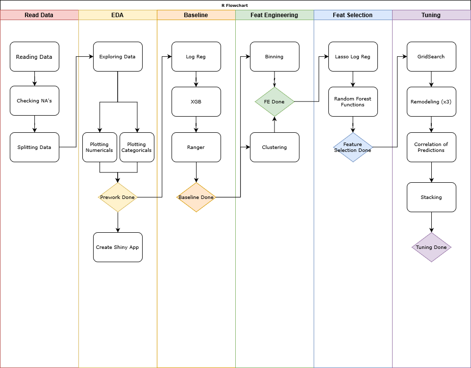

```{r setup, include=FALSE}
knitr::opts_chunk$set(echo = TRUE)
```

```{r Load Libraries, echo = FALSE, include = FALSE}
source('scripts/install_packages.R')

if (is.null(webshot:::find_phantom())) {
  webshot::install_phantomjs()
}
```

``` {r Load Prepared Data, echo = FALSE}
load('data_output/RMarkdown_Objects.RData')
```

``` {r Palettes, echo = FALSE}
BarFillColor <- "#330066"
HBarFillColor <- "#000099"
BarLineColor <- "#FFFAFA"
MissingColor <- "#FF6666"

color1 = 'white'
color2 = 'black'
color3 = 'black'
color4 = 'darkorchid3'
font1 = 'Impact'
font2 = 'Helvetica'
```

</br>

***

## Bank Marketing Dataset  

The *Bank Marketing* dataset contains the **direct marketing campaigns of a Portuguese banking institution**. The original dataset can be found on [Kaggle](https://www.kaggle.com/henriqueyamahata/bank-marketing).  

All the files of this project are saved in a [GitHub repository](https://github.com/ashomah/Bank-Marketing).  

The dataset consists in:  

* **Train Set** with `r format(nrow(raw_train), big.mark=',')` observations with `r length(raw_train)-1` features and the target `y`.  
* **Test Set** with `r format(nrow(raw_test), big.mark=',')` observations with `r length(raw_test)` features. The `y` column will be added to the Test Set, with NAs, to ease the pre-processing stage.  

This project aims to predict if a customer will subscribe to a bank term deposit, based on its features and call history of previous marketing campaigns.  

</br>

***

## Packages  

<span style="color:red">This analysis requires these R packages:</span>  

* Data Manipulation: `data.table`, `dplyr`, `tibble`, `tidyr`  
    
* Plotting: `corrplot`, `GGally`, `ggmap`, `ggplot2`, `grid`, `gridExtra`  
    
* Machine Learning: `caret`, `dbscan`, `glmnet`, `leaderCluster`, `MLmetrics`, `ranger`, `xgboost`  

* Multithreading: `doMC`, `doParallel`, `factoextra`, `foreach`, `parallel`  

* Reporting: `kableExtra`, `knitr`, `RColorBrewer`, `shiny`, and... `beepr`.  

These packages are installed and loaded if necessary by the main script.

</br>

***
 
## Data Loading  

The data seems to be pretty clean, the variables being a combination of integers and factors with no null values.  

``` {r NAs, echo = FALSE, collapse=TRUE}
# Check if contains NAs ----
na_count <-
  sapply(raw_train, function(y)
    sum(length(which(is.na(
      y
    )))))
na_count <- data.frame(na_count)
na_count$perc <- round(na_count$na_count / nrow(raw_train) * 100, 2)
print(paste0(nrow(na_count[na_count$na_count != 0,]), ' columns of the Train Set have NAs.'))

na_count <-
  sapply(raw_test, function(y)
    sum(length(which(is.na(
      y
    )))))
na_count <- data.frame(na_count)
na_count$perc <- round(na_count$na_count / nrow(raw_test) * 100, 2)
print(paste0(nrow(na_count[na_count$na_count != 0,]), ' columns of the Test Set have NAs.'))
```

</br>

As this analysis is a classification, the target `y` has to be set as factor. The structures of the datasets after initial preparation are:  

``` {r Structure Train, echo = FALSE, collapse = TRUE}
str_train <- capture.output(str(bank_train))
cat('Structure of the Train Set:')
cat(str_train, sep='\n')
```

``` {r Structure Test, echo = FALSE, collapse = TRUE}
str_test <- capture.output(str(bank_test))
cat('Structure of the Test Set:')
cat(str_test, sep='\n')
```

</br>

***

## Exploratory Data Analysis  

The target of this analysis is the variable `y`. This boolean indicates whether the customer has acquiered a bank term deposit account. With `r format(length(bank_train[bank_train$y == 'No', 'y'])/nrow(bank_train)*100, nsmall = 1, digits=2)`% of the customers having subscribed to this product, we can say that our Train set is slightly unbalanced. We might want to try rebalancing our dataset later in this analysis, to ensure our model is performing properly for unknown data.  

The features of the dataset provide different type of information about the customers.  

</br>

* Variables giving **personal information** of the customers:  

  * **`age`** of the customer  
  Customers are between `r min(bank_train$age)` and `r max(bank_train$age)` years old, with a mean of `r mean(bank_train$age)` and a median of `r median(bank_train$age)`. The inter-quartile range is between `r quantile(bank_train$age, 0.25)` and `r quantile(bank_train$age, 0.75)`. We can also notice the presence of some outliers.  

  * **`job`** category of the customer  
  There are `r length(unique(bank_train$job))` categories of jobs with more than half belonging to `blue-collar`, `management` and `technicians`, followed by admin and services. Retired candidates form `r format(length(bank_train[bank_train$job == 'retired', 'job'])/nrow(bank_train)*100, digits=0, nsmall=0)`% of the dataset, self-emplyed and entrepreneur around 6% and unemployed, housemaid and students each around 2%. The candidate with unknow jobs form less than 1%.

  * **`marital`** status of the customer  
 `r format(length(bank_train[bank_train$marital == 'married', 'marital'])/nrow(bank_train)*100, digits=0, nsmall=0)`% are married, `r format(length(bank_train[bank_train$marital == 'single', 'marital'])/nrow(bank_train)*100, digits=0, nsmall=0)`% are single, the others are divorced.  

  * **`education`** level of the customer  
  `r format(length(bank_train[bank_train$education == 'secondary', 'education'])/nrow(bank_train)*100, digits=0, nsmall=0)`% of the customers went to secondary school, `r format(length(bank_train[bank_train$education == 'tertiary', 'marital'])/nrow(bank_train)*100, digits=0, nsmall=0)`% to tertiary school, `r format(length(bank_train[bank_train$education == 'primary', 'marital'])/nrow(bank_train)*100, digits=0, nsmall=0)`% to primary school. The education of the other customers remains unknown.  

</br>

* Variables related to **financial status** of the customers:  

  * **`default`** history  
  This boolean indicates if the customer has already defaulted. Only `r format(length(bank_train[bank_train$default == 1, 'default'])/nrow(bank_train)*100, digits=1, nsmall=1)`% of the customers have defaulted.  

  * **`balance`** of customer's account  
  The average yearly balance of the customer in euros. The variable is ranged from `r format(min(bank_train$balance), digits=0, nsmall=0, big.mark=',')` to `r format(max(bank_train$balance), digits=0, nsmall=0, big.mark=',')` with a mean of `r format(mean(bank_train$balance), digits=0, nsmall=0, big.mark=',')` and a median of `r format(median(bank_train$balance), digits=0, nsmall=0, big.mark=',')`. The data is highly right-skewed.  

  * **`housing` ** loan  
  This boolean indicates if the customer has a house loan. `r format(length(bank_train[bank_train$housing == 1, 'housing'])/nrow(bank_train)*100, digits=0, nsmall=0)`% of the customers have one.  

  * **`loan`**  
  This boolean indicates if the customer has a personal loan. `r format(length(bank_train[bank_train$loan == 1, 'loan'])/nrow(bank_train)*100, digits=0, nsmall=0)`% of the customers have one.  

</br>

* Variables related to **campaign interactions** with the customer:  

  * **`contact`** mode  
  How the customer was contacted, with `r format(length(bank_train[bank_train$contact == 'cellular', 'contact'])/nrow(bank_train)*100, digits=0, nsmall=0)`% on their mobile phone, and `r format(length(bank_train[bank_train$contact == 'telephone', 'contact'])/nrow(bank_train)*100, digits=0, nsmall=0)`% ona landline.  

  * **`day`**  
  This indicates on which day of the month the customer was contacted.  

  * **`month`**  
  This indicates on which month the customer was contacted. May seems to be the peak month with `r format(length(bank_train[bank_train$month == 'may', 'month'])/nrow(bank_train)*100, digits=0, nsmall=0)`% of the calls followed by June, July, and August.  

  * **`duration`** of the call  
  Last phone call duration in seconds. The average call lasts around `r format(mean(bank_train$duration)/60, digits=0, nsmall=0)` minutes. However, the longest call lasts `r format(max(bank_train$duration)/60/60, digits=1, nsmall=1)` hours.

  * **`campaign`**  
  Number of times the customer was contacted *during* this campaign. Customers can have been contacted up to `r max(bank_train$campaign)` times. Around `r format(length(bank_train[bank_train$campaign <= 2, 'campaign'])/nrow(bank_train)*100, digits=0, nsmall=0)`% were contacted twice or less.  

  * **`pdays`**  
  Number of days that passed after the customer was last contacted from a previous campaign. `-1` means that the client was not previously contacted and this is his first campaign. Around `r format(length(bank_train[bank_train$pdays == -1, 'pdays'])/nrow(bank_train)*100, digits=0, nsmall=0)`% of the candidates are newly campaign clients. The average time elapsed is `r format(mean(bank_train$pdays), digits=0, nsmall=0)` days.  

  * **`previous`** contacts  
  Number of contacts performed *before* this campaign. Majority of the customers were never contacted. Other customers have been contacted `r format(mean(bank_train[bank_train$previous != -1, 'previous']), digits=0, nsmall=0)` times on average, with a maximum of `r format(max(bank_train[bank_train$previous != -1, 'previous']), digits=0, nsmall=0)` times.  

  * **`poutcome`**
  This categorical variable indicates the outcome from a previous campaign, whether it was a success or a failure. About `r format(length(bank_train[bank_train$poutcome == 'success', 'poutcome'])/nrow(bank_train)*100, digits=0, nsmall=0)`% of the customers answered positively to previous campaigns.  

</br>

<iframe src ="http://ashomah.shinyapps.io/plot_eda" height=800px width=100% position="center" frameborder="0" />

</br>

A quick look at the Test Set shows that the variables follow almost similar distriutions.  


</br>

***

## Analysis Method  

 
``` {r Show Code Main Script, echo = TRUE, eval = FALSE, collapse = TRUE}
####
#### THIS SCRIPT CALLS ALL SUB-SCRIPTS TO READ AND PREPARE THE DATASET,
#### RUN THE ANALYSIS AND OUTPUT RELEVANT DATA FILES
####

start_time <- Sys.time()
print(paste0('---START--- Starting at ', start_time))

options(warn = 0) # -1 to hide the warnings, 0 to show them
seed <- 2019
set.seed(seed)

# Install Necessary Packages ----
source('scripts/install_packages.R')

# Read and Format Dataset ----
source('scripts/read_format_data.R')

# Split and Preprocess Dataset ----
source('scripts/split_n_preproc.R')

# Model Pipelines ----
source('scripts/model_glm.R')
source('scripts/model_xgbTree.R')
source('scripts/model_ranger.R')
source('scripts/model_stacking.R')

# Parameters of Baseline ----
source('scripts/param_modeling.R')

# Baseline Logistic Regression ----
pipeline_glm(target = 'y', train_set = bank_train_A_proc_dum,
             valid_set = bank_train_B_proc_dum, test_set = bank_test_proc_dum,
             trControl = fitControl, tuneGrid = NULL,
             suffix = 'baseline', calculate = FALSE, seed = seed,
             n_cores = detectCores()-1)

# Baseline XGBoost ----
pipeline_xgbTree(target = 'y', train_set = bank_train_A_proc_dum,
                 valid_set = bank_train_B_proc_dum, test_set = bank_test_proc_dum,
                 trControl = fitControl, tuneGrid = NULL,
                 suffix = 'baseline', calculate = FALSE, seed = seed,
                 n_cores = detectCores()-1)

# Baseline Ranger ----
pipeline_ranger(target = 'y', train_set = bank_train_A_proc_dum,
                 valid_set = bank_train_B_proc_dum, test_set = bank_test_proc_dum,
                 trControl = fitControl, tuneGrid = NULL,
                 suffix = 'baseline', calculate = FALSE, seed = seed,
                 n_cores = detectCores()-1)

# Feature Engineering Clustering ----
calculate <- FALSE
source('scripts/fe_clusters.R')

# Logistic Regression Clustering ----
pipeline_glm(target = 'y', train_set = bank_train_A_FE1,
             valid_set = bank_train_B_FE1, test_set = bank_test_FE1,
             trControl = fitControl, tuneGrid = NULL,
             suffix = 'FE1 Clustering', calculate = FALSE, seed = seed,
             n_cores = detectCores()-1)

# XGBoost Clustering ----
pipeline_xgbTree(target = 'y', train_set = bank_train_A_FE1,
             valid_set = bank_train_B_FE1, test_set = bank_test_FE1,
             trControl = fitControl, tuneGrid = NULL,
             suffix = 'FE1 Clustering', calculate = FALSE, seed = seed,
             n_cores = detectCores()-1)

# Ranger Clustering ----
pipeline_ranger(target = 'y', train_set = bank_train_A_FE1,
                valid_set = bank_train_B_FE1, test_set = bank_test_FE1,
                trControl = fitControl, tuneGrid = NULL,
                suffix = 'FE1 Clustering', calculate = FALSE, seed = seed,
                n_cores = detectCores()-1)

# Feature Engineering Binning ----
source('scripts/fe_binning.R')

# Logistic Regression Binning ----
pipeline_glm(target = 'y', train_set = bank_train_A_FE2,
             valid_set = bank_train_B_FE2, test_set = bank_test_FE2,
             trControl = fitControl, tuneGrid = NULL,
             suffix = 'FE2 Binning', calculate = FALSE, seed = seed,
             n_cores = detectCores()-1)

# XGBoost Binning ----
pipeline_xgbTree(target = 'y', train_set = bank_train_A_FE2,
                 valid_set = bank_train_B_FE2, test_set = bank_test_FE2,
                 trControl = fitControl, tuneGrid = NULL,
                 suffix = 'FE2 Binning', calculate = FALSE, seed = seed,
                 n_cores = detectCores()-1)

# Ranger Binning ----
pipeline_ranger(target = 'y', train_set = bank_train_A_FE2,
                valid_set = bank_train_B_FE2, test_set = bank_test_FE2,
                trControl = fitControl, tuneGrid = NULL,
                suffix = 'FE2 Binning', calculate = FALSE, seed = seed,
                n_cores = detectCores()-1)

# Feature Selection Lasso ----
source('scripts/featsel_lasso.R')

# Feature Selection RFE ----
calculate <- FALSE
source('scripts/featsel_rfe.R')

# Logistic Regression Post RFE ----
pipeline_glm(target = 'y', train_set = bank_train_A_rfe,
                 valid_set = bank_train_B_rfe, test_set = bank_test_rfe,
                 trControl = fitControl, tuneGrid = NULL,
                 suffix = 'RFE', calculate = FALSE, seed = seed,
                 n_cores = detectCores()-1)

# XGBoost Post RFE ----
pipeline_xgbTree(target = 'y', train_set = bank_train_A_rfe,
                 valid_set = bank_train_B_rfe, test_set = bank_test_rfe,
                 trControl = fitControl, tuneGrid = NULL,
                 suffix = 'RFE', calculate = FALSE, seed = seed,
                 n_cores = detectCores()-1)

# XGBoost Tuning ----
pipeline_xgbTree(target = 'y', train_set = bank_train_A_rfe,
                 valid_set = bank_train_B_rfe, test_set = bank_test_rfe,
                 trControl = tuningControl, tuneGrid = xgb_grid,
                 suffix = 'Tuning', calculate = FALSE, seed = seed,
                 n_cores = detectCores()-1)

# Ranger Tuning ----
pipeline_ranger(target = 'y', train_set = bank_train_A_rfe,
                 valid_set = bank_train_B_rfe, test_set = bank_test_rfe,
                 trControl = tuningControl, tuneGrid = ranger_grid,
                 suffix = 'Tuning', calculate = FALSE, seed = seed,
                 n_cores = detectCores()-1)

# Baseline Stacking Logistic Regression | Ranger | xgbTree ----
pipeline_stack(target = 'y', train_set = bank_train_A_proc_dum,
                valid_set = bank_train_B_proc_dum, test_set = bank_test_proc_dum,
                trControl = fitControl, tuneGrid = NULL,
                suffix = 'baseline', calculate = FALSE, seed = seed,
                n_cores = detectCores()-1)

# Baseline Stacking Logistic Regression | Ranger | xgbTree ----
pipeline_stack(target = 'y', train_set = bank_train_A_FE1,
               valid_set = bank_train_B_FE1, test_set = bank_test_FE1,
               trControl = fitControl, tuneGrid = NULL,
               suffix = 'clustering', calculate = FALSE, seed = seed,
               n_cores = detectCores()-1)

# Baseline Stacking Logistic Regression | Ranger | xgbTree ----
pipeline_stack(target = 'y', train_set = bank_train_A_FE2,
               valid_set = bank_train_B_FE2, test_set = bank_test_FE2,
               trControl = fitControl, tuneGrid = NULL,
               suffix = 'binning', calculate = FALSE, seed = seed,
               n_cores = detectCores()-1)

# Baseline Stacking Logistic Regression | Ranger | xgbTree ----
pipeline_stack(target = 'y', train_set = bank_train_A_rfe,
               valid_set = bank_train_B_rfe, test_set = bank_test_rfe,
               trControl = fitControl, tuneGrid = NULL,
               suffix = 'Tuning', calculate = FALSE, seed = seed,
               n_cores = detectCores()-1)

# Creating the table with the sensitivities for different thresholds
source('scripts/sensitivity_thresholds.R')

print(paste0('[', round(
  difftime(Sys.time(), start_time, units = 'mins'), 1
), 'm]: ',
'All operations are over!'))


# Render RMarkdown Report ----
if (is.null(webshot:::find_phantom())) {
  webshot::install_phantomjs()
}
invisible(
  rmarkdown::render(
    'Bank-Marketing-Report.Rmd',
    'github_document',
    params = list(shiny = FALSE),
    runtime = 'static'
  )
)
invisible(
  rmarkdown::render(
    'Bank-Marketing-Report.Rmd',
    'html_document',
    params = list(shiny = TRUE),
    output_options = list(code_folding = 'hide')
  )
)
# # invisible(rmarkdown::run('Bank-Marketing-Report.Rmd'))

# beep(8)
#
# print(paste0('[', round(
#   difftime(Sys.time(), start_time, units = 'mins'), 1
# ), 'm]: ',
# 'Report generated! ---END---'))

```
</br>

***

## Data Preparation  

As the Test Set doesn't contain the feature `y`, it is necessary to randomly split the Train Set in two, with a 80|20 ratio:  

* **Train Set A**, which will be used to train our model.  
* **Train Set B**, which will be used to test our model and validate the performance of the model.  

These datasets are centered and scaled, using the `preProcess` function of the package `caret`. These transformations should improve the performance of linear models.  

Categorical variables are dummified, using the `  

``` {r Show Code Data Preprocess, echo = TRUE, eval = FALSE, collapse = TRUE}
####
#### THIS SCRIPT SPLIT THE TRAIN SET AND 
####

seed <- ifelse(exists('seed'), seed, 2019)
set.seed(seed)

# Splitting Train Set into two parts ----

index <-
  createDataPartition(bank_train$y,
                      p = 0.8,
                      list = FALSE,
                      times = 1)
bank_train_A <- bank_train[index,]
bank_train_B <- bank_train[-index,]

print(paste0(
  ifelse(exists('start_time'), paste0('[', round(
    difftime(Sys.time(), start_time, units = 'mins'), 1
  ), 'm]: '), ''),
  'Train Set is split!'))


# Center and Scale Train Sets and Test Set ----
preProcValues <-
  preProcess(bank_train_A, method = c("range"), rangeBounds = c(0, 1) )
bank_train_A_proc <- predict(preProcValues, bank_train_A)
bank_train_B_proc <- predict(preProcValues, bank_train_B)
bank_test_proc <- predict(preProcValues, bank_test)


# Dummify the datasets
dummy_train <- dummyVars(formula = '~.', data = bank_train_A_proc[, !names(bank_train_A_proc) %in% c('y')])
assign('bank_train_A_proc_dum', as.data.frame(cbind(
  predict(dummy_train, bank_train_A_proc[, !names(bank_train_A_proc) %in% c('y')]),
  bank_train_A_proc[, 'y']
)))
colnames(bank_train_A_proc_dum) <- c(colnames(bank_train_A_proc_dum)[-length(colnames(bank_train_A_proc_dum))], 'y')
bank_train_A_proc_dum[,'y'] <- as.factor(bank_train_A_proc_dum[,'y'])
levels(bank_train_A_proc_dum$y) <- c('No', 'Yes')

dummy_valid <- dummyVars(formula = '~.', data = bank_train_B_proc[, !names(bank_train_B_proc) %in% c('y')])
assign('bank_train_B_proc_dum', as.data.frame(cbind(
  predict(dummy_valid, bank_train_B_proc[, !names(bank_train_B_proc) %in% c('y')]),
  bank_train_B_proc[, 'y']
)))
colnames(bank_train_B_proc_dum) <- c(colnames(bank_train_B_proc_dum)[-length(colnames(bank_train_B_proc_dum))], 'y')
bank_train_B_proc_dum[,'y'] <- as.factor(bank_train_B_proc_dum[,'y'])
levels(bank_train_B_proc_dum$y) <- c('No', 'Yes')

dummy_test <- dummyVars(formula = '~.', data = bank_test_proc[, !names(bank_test_proc) %in% c('y')])
assign('bank_test_proc_dum', as.data.frame(cbind(
  predict(dummy_test, bank_test_proc[, !names(bank_test_proc) %in% c('y')]),
  bank_test_proc[, 'y']
)))
colnames(bank_test_proc_dum) <- c(colnames(bank_test_proc_dum)[-length(colnames(bank_test_proc_dum))], 'y')
bank_test_proc_dum[,'y'] <- as.factor(bank_test_proc_dum[,'y'])
levels(bank_test_proc_dum$y) <- c('No', 'Yes')


print(paste0(
  ifelse(exists('start_time'), paste0('[', round(
    difftime(Sys.time(), start_time, units = 'mins'), 1
  ), 'm]: '), ''),
  'Data Sets are centered and scaled!'
))

```

</br>

***

## Cross-Validation Strategy  

To validate the stability of our models, we will apply a 10-fold cross-validation, repeated 3 times.   
(*Note: for the stacking that is explained in the following part of the report we use another, more extensive cross validation approach*)

``` {r Show Code Cross Validation | Parameter Tuning, echo = TRUE, eval = FALSE, collapse = TRUE}
####
#### THIS SCRIPT DEFINES PARAMETERS AND FUNCTIONS FOR MODELING
####

seed <- ifelse(exists('seed'), seed, 2019)
set.seed(seed)

time_fit_start <- 0
time_fit_end <- 0
all_results <- data.frame()
all_real_results <- data.frame()
file_list <- data.frame()


# Cross-Validation Settings ----
fitControl <-
  trainControl(
    method = 'repeatedcv',
    number = 10,
    repeats = 3,
    verboseIter = TRUE,
    allowParallel = TRUE,
    classProbs = TRUE,
    savePredictions = TRUE
  )

print(paste0(
  ifelse(exists('start_time'), paste0('[', round(
    difftime(Sys.time(), start_time, units = 'mins'), 1
  ),
  'm]: '), ''),
  'Fit Control will use ',
  fitControl$method,
  ' with ',
  fitControl$number,
  ' folds and ',
  fitControl$repeats,
  ' repeats.'
))


# Cross-Validation for Tuning Settings ----
tuningControl <-
  trainControl(
    method = 'cv',
    number = 10,
    verboseIter = TRUE,
    allowParallel = TRUE,
    classProbs = TRUE,
    savePredictions = TRUE
  )

print(paste0(
  ifelse(exists('start_time'), paste0('[', round(
    difftime(Sys.time(), start_time, units = 'mins'), 1
  ),
  'm]: '), ''),
  'Tuning Control will use ',
  tuningControl$method,
  ' with ',
  tuningControl$number,
  ' folds and ',
  tuningControl$repeats,
  ' repeats.'
))


# Default tuneGrid for Random Forest ----
ranger_grid = expand.grid(
  mtry = c(1, 2, 3, 4, 5, 6, 7, 10),
  splitrule = c('gini'),
  min.node.size = c(5, 6, 7, 8, 9, 10)
)


# Default tuneGrid for XGBoost ----
nrounds = 1000

xgb_grid = expand.grid(
  nrounds = seq(from = 200, to = nrounds, by = 100),
  max_depth = c(5, 6, 7, 8, 9),
  eta = c(0.025, 0.05, 0.1, 0.2, 0.3),
  gamma = 0,
  colsample_bytree = 1,
  min_child_weight = c(2, 3, 5),
  subsample = 1
)

```


</br>

***

## Baseline  

For our baseline, we used 3 algorithms.  

``` {r Baseline Results, echo=FALSE, message = FALSE, fig.align = 'center'}
to_display <-
  all_real_results[rownames(all_real_results) %in% c(
    'Logistic Reg. baseline',
    'XGBoost baseline',
    'Ranger baseline'
  ),]


to_display[order(to_display$Sensitivity, decreasing = TRUE), ] %>%
  rownames_to_column('Model') %>%
  mutate(
    Sensitivity = cell_spec(
      format(Sensitivity, nsmall = 7),
      color = ifelse(order(Sensitivity, decreasing = TRUE) <= 1, 'white', 'ghostwhite'),
      font_size = ifelse(order(Sensitivity, decreasing = TRUE) <= 1, 12, 11),
      background = spec_color(
        order(Sensitivity, decreasing = TRUE),
        option = 'D',
        begin = 0.50,
        end = 0.98,
        direction = 1
      ),
      bold = ifelse(order(Sensitivity, decreasing = TRUE) <= 1, TRUE, FALSE)
    )
  ) %>%
  kable(escape = FALSE, align = 'r') %>% kable_styling(bootstrap_options = c('hover', 'condensed'))
```


``` {r Show Code Training Function, echo = TRUE, eval = FALSE, collapse = TRUE}
####
#### THIS SCRIPT FITS A LOGISTIC REGRESSION MODEL AND MAKE PREDICTIONS
####

# Set seed
seed <- ifelse(exists('seed'), seed, 2019)
set.seed(seed)


pipeline_glm <- function(target, train_set, valid_set, test_set,
                         trControl = NULL, tuneGrid = NULL,
                         suffix = NULL, calculate = FALSE, seed = 2019,
                         n_cores = 1){
  
  # Define objects suffix
  suffix <- ifelse(is.null(suffix), NULL, paste0('_', suffix))  
  
  # Default trControl if input is NULL
  if (is.null(trControl)){
    trControl <- trainControl()
  }
  
  # Logistic Regression ----
  if (calculate == TRUE) {
    
    # Set up Multithreading
    library(doParallel)
    cl <- makePSOCKcluster(n_cores)
    clusterEvalQ(cl, library(foreach))
    registerDoParallel(cl)
    
    print(paste0(
      ifelse(exists('start_time'), paste0('[', round(
        difftime(Sys.time(), start_time, units = 'mins'), 1
      ),
      'm]: '), ''),
      'Starting Logistic Regression Model Fit... ',
      ifelse(is.null(suffix), NULL, paste0(' ', substr(
        suffix, 2, nchar(suffix)
      )))
    ))
    
    # Model Training
    time_fit_start <- Sys.time()
    assign(
      paste0('fit_glm', suffix),
      train(
        x = train_set[, !names(train_set) %in% c(target)],
        y = train_set[, target],
        method = 'glm',
        trControl = trControl,
        tuneGrid = tuneGrid,
        metric = 'Accuracy'
      )
      , envir = .GlobalEnv) 
    time_fit_end <- Sys.time()
    
    # Stop Multithreading
    stopCluster(cl)
    registerDoSEQ()
    
    # Save model
    assign(paste0('time_fit_glm', suffix),
           time_fit_end - time_fit_start, envir = .GlobalEnv)
    saveRDS(get(paste0('fit_glm', suffix)), paste0('models/fit_glm', suffix, '.rds'))
    saveRDS(get(paste0('time_fit_glm', suffix)), paste0('models/time_fit_glm', suffix, '.rds'))
  }
  
  # Load Model
  assign(paste0('fit_glm', suffix),
         readRDS(paste0('models/fit_glm', suffix, '.rds')), envir = .GlobalEnv)
  assign(paste0('time_fit_glm', suffix),
         readRDS(paste0('models/time_fit_glm', suffix, '.rds')), envir = .GlobalEnv)
  
  # Predicting against Valid Set with transformed target
  assign(paste0('pred_glm', suffix),
         predict(get(paste0('fit_glm', suffix)), valid_set, type = 'prob'), envir = .GlobalEnv)
  assign(paste0('pred_glm_prob', suffix), get(paste0('pred_glm', suffix)), envir = .GlobalEnv)
  assign(paste0('pred_glm', suffix), get(paste0('pred_glm_prob', suffix))$Yes, envir = .GlobalEnv)

  assign(paste0('pred_glm', suffix), ifelse(get(paste0('pred_glm', suffix)) > 0.5, no = 0, yes = 1), envir = .GlobalEnv)
  
  # Storing Sensitivity for different thresholds
  sens_temp <- data.frame(rbind(rep_len(0, length(seq(from = 0.05, to = 1, by = 0.05)))))
  temp_cols <- c()
  for (t in seq(from = 0.05, to = 1, by =0.05)){
    temp_cols <- cbind(temp_cols, paste0('t_', format(t, nsmall=2)))
  }
  colnames(sens_temp) <- temp_cols

  valid_set[,target] <- ifelse(valid_set[,target]=='No',0,1)

  for (t in seq(from = 0.05, to = 1, by = 0.05)){
    assign(paste0('tres_pred_glm', suffix, '_', format(t, nsmall=2)), ifelse(get(paste0('pred_glm_prob', suffix))$Yes > t, no = 0, yes = 1), envir = .GlobalEnv)
    sens_temp[, paste0('t_', format(t, nsmall=2))] <- Sensitivity(y_pred = get(paste0('tres_pred_glm', suffix, '_', format(t, nsmall=2))),
                                                                  y_true = valid_set[,target], positive = '1')
    
  }  
  assign(paste0('sens_temp_glm', suffix), sens_temp, envir = .GlobalEnv)
  
  
  # Compare Predictions and Valid Set
  assign(paste0('comp_glm', suffix),
         data.frame(obs = valid_set[,target],
                    pred = get(paste0('pred_glm', suffix))), envir = .GlobalEnv)
  
  # Generate results with transformed target
  assign(paste0('results', suffix),
         as.data.frame(
           rbind(
             cbind('Accuracy' = Accuracy(y_pred = get(paste0('pred_glm', suffix)),
                                         y_true = valid_set[,target]),
                   'Sensitivity' = Sensitivity(y_pred = get(paste0('pred_glm', suffix)),
                                               y_true = valid_set[,target], positive = '1'),
                   'Precision' = Precision(y_pred = get(paste0('pred_glm', suffix)),
                                           y_true = valid_set[,target], positive = '1'),
                   'Recall' = Recall(y_pred = get(paste0('pred_glm', suffix)),
                                     y_true = valid_set[,target], positive = '1'),
                   'F1 Score' = F1_Score(y_pred = get(paste0('pred_glm', suffix)),
                                         y_true = valid_set[,target], positive = '1'),
                   'AUC'      = AUC::auc(AUC::roc(as.numeric(valid_set[,target]), as.factor(get(paste0('pred_glm', suffix))))),
                   'Coefficients' = length(get(paste0('fit_glm', suffix))$finalModel$coefficients),
                   'Train Time (min)' = round(as.numeric(get(paste0('time_fit_glm', suffix)), units = 'mins'), 1),
                   'CV | Accuracy' = get_best_result(get(paste0('fit_glm', suffix)))[, 'Accuracy'],
                   'CV | Kappa' = get_best_result(get(paste0('fit_glm', suffix)))[, 'Kappa'],
                   'CV | AccuracySD' = get_best_result(get(paste0('fit_glm', suffix)))[, 'AccuracySD'],
                   'CV | KappaSD' = get_best_result(get(paste0('fit_glm', suffix)))[, 'KappaSD']
             )
           ), envir = .GlobalEnv
         )
  )
  
  # Generate all_results table | with CV and transformed target
  results_title = paste0('Logistic Reg.', ifelse(is.null(suffix), NULL, paste0(' ', substr(suffix,2, nchar(suffix)))))
  
  if (exists('all_results')){
    assign('all_results', rbind(all_results, get(paste0('results', suffix))), envir = .GlobalEnv)
    rownames(all_results) <- c(rownames(all_results)[-length(rownames(all_results))], results_title)
    assign('all_results', all_results, envir = .GlobalEnv)
  } else{
    assign('all_results', rbind(get(paste0('results', suffix))), envir = .GlobalEnv)
    rownames(all_results) <- c(rownames(all_results)[-length(rownames(all_results))], results_title)
    assign('all_results', all_results, envir = .GlobalEnv)
  }
  
  # Save Variables Importance plot
  png(
    paste0('plots/fit_glm_', ifelse(is.null(suffix), NULL, paste0(substr(suffix,2, nchar(suffix)), '_')), 'varImp.png'),
    width = 1500,
    height = 1000
  )
  p <- plot(varImp(get(paste0('fit_glm', suffix))), top = 30)
  print(p)
  dev.off()
  
  # Predicting against Test Set
  assign(paste0('pred_glm_test', suffix), predict(get(paste0('fit_glm', suffix)), test_set), envir = .GlobalEnv)
  
  submissions_test <- as.data.frame(cbind(
    get(paste0('pred_glm_test', suffix)) # To adjust if target is transformed
  ))
  colnames(submissions_test) <- c(target)
  assign(paste0('submission_glm_test', suffix), submissions_test, envir = .GlobalEnv)
  
  # Generating submissions file
  write.csv(get(paste0('submission_glm_test', suffix)),
            paste0('submissions/submission_glm', suffix, '.csv'),
            row.names = FALSE)
  
  
  # Predicting against Valid Set with original target
  assign(paste0('pred_glm_valid', suffix), predict(get(paste0('fit_glm', suffix)), valid_set), envir = .GlobalEnv)
  
  # Generate real_results with original target
  submissions_valid <- as.data.frame(cbind(
    get(paste0('pred_glm_valid', suffix)) # To adjust if target is transformed
  ))
  colnames(submissions_valid) <- c(target)
  submissions_valid[,'y'] <- ifelse(submissions_valid[,'y']=='1',0,1)
  assign(paste0('submission_glm_valid', suffix), submissions_valid, envir = .GlobalEnv)
  
  assign(paste0('real_results', suffix), as.data.frame(cbind(
    'Accuracy' = Accuracy(y_pred = get(paste0('submission_glm_valid', suffix))[, target], y_true = as.numeric(valid_set[, c(target)])),
    'Sensitivity' = Sensitivity(y_pred = get(paste0('submission_glm_valid', suffix))[, target], y_true = as.numeric(valid_set[, c(target)]), positive = '1'),
    'Precision' = Precision(y_pred = get(paste0('submission_glm_valid', suffix))[, target], y_true = as.numeric(valid_set[, c(target)]), positive = '1'),
    'Recall' = Recall(y_pred = get(paste0('submission_glm_valid', suffix))[, target], y_true = as.numeric(valid_set[, c(target)]), positive = '1'),
    'F1 Score' = F1_Score(y_pred = get(paste0('submission_glm_valid', suffix))[, target], y_true = as.numeric(valid_set[, c(target)]), positive = '1'),
    'AUC'      = AUC::auc(AUC::roc(as.numeric(valid_set[, c(target)]), as.factor(get(paste0('submission_glm_valid', suffix))[, target]))),
    'Coefficients' = length(get(paste0('fit_glm', suffix))$finalModel$coefficients),
    'Train Time (min)' = round(as.numeric(get(paste0('time_fit_glm', suffix)), units = 'mins'), 1)
  )), envir = .GlobalEnv)
  
  # Generate all_real_results table with original target
  if (exists('all_real_results')){
    assign('all_real_results', rbind(all_real_results, results_title = get(paste0('real_results', suffix))), envir = .GlobalEnv)
    rownames(all_real_results) <- c(rownames(all_real_results)[-length(rownames(all_real_results))], results_title)
    assign('all_real_results', all_real_results, envir = .GlobalEnv)
  } else{
    assign('all_real_results', rbind(results_title = get(paste0('real_results', suffix))), envir = .GlobalEnv)
    rownames(all_real_results) <- c(rownames(all_real_results)[-length(rownames(all_real_results))], results_title)
    assign('all_real_results', all_real_results, envir = .GlobalEnv)
  }
  
  # Plot ROC
  roc_glm <- AUC::roc(as.factor(valid_set[, c(target)]), as.factor(get(paste0('submission_glm_valid', suffix))[, target]))
  assign(paste0('roc_object_glm', suffix), roc_glm,  envir = .GlobalEnv)
  # plot(get(paste0('roc_object_glm', suffix)), col=color4, lwd=4, main="ROC Curve GLM")
  
  # Density Plot
  prob_glm <- get(paste0('pred_glm_prob', suffix))
  prob_glm<- melt(prob_glm)
  assign(paste0('density_plot_glm', suffix), ggplot(prob_glm,aes(x=value, fill=variable)) + geom_density(alpha=0.25)+
           theme_tufte(base_size = 5, ticks=F)+ 
           ggtitle(paste0('Density Plot glm', suffix))+
           theme(plot.margin = unit(c(10,10,10,10),'pt'),
                 axis.title=element_blank(),
                 axis.text = element_text(colour = color2, size = 9, family = font2),
                 axis.text.x = element_text(hjust = 1, size = 9, family = font2),
                 plot.title = element_text(size = 15, face = "bold", hjust = 0.5), 
                 plot.background = element_rect(fill = color1)), envir = .GlobalEnv)
  
  # get(paste0('density_plot_glm', suffix))
  
  # Confusion Matrix
  assign(paste0('cm_glm', suffix), confusionMatrix(as.factor(get(paste0('submission_glm_valid', suffix))[, target]), as.factor(valid_set[, c(target)])), envir = .GlobalEnv)
  # cm_plot_glm <- fourfoldplot(cm_glm$table)
  # assign(paste0('cm_plot_glm', suffix), cm_plot_glm, envir = .GlobalEnv)
  # get(paste0('cm_plot_glm', suffix))
  
  # List of files for Dashboard
  assign(paste0('files', suffix), as.data.frame(cbind(
    'model_file' = paste0('fit_glm', suffix),
    'cm_file' = paste0('cm_glm', suffix),
    'roc' = paste0('roc_object_glm', suffix),
    'density' = paste0('density_plot_glm', suffix)
  )), envir = .GlobalEnv)
  
  if (exists('file_list')){
    assign('file_list', rbind(file_list, 'model_file' = get(paste0('files', suffix))), envir = .GlobalEnv)
    rownames(file_list) <- c(rownames(file_list)[-length(rownames(file_list))], results_title)
    assign('file_list', file_list, envir = .GlobalEnv)
  } else{
    assign('file_list', rbind('model_file' = get(paste0('files', suffix))), envir = .GlobalEnv)
    rownames(file_list) <- c(rownames(file_list)[-length(rownames(file_list))], results_title)
    assign('file_list', file_list, envir = .GlobalEnv)
  }
  
  
  print(paste0(
    ifelse(exists('start_time'), paste0('[', round(
      difftime(Sys.time(), start_time, units = 'mins'), 1
    ), 'm]: '), ''),
    'Logistic Regression is done!', ifelse(is.null(suffix), NULL, paste0(' ', substr(suffix,2, nchar(suffix))))))
}

```

</br>

***
</br>

***

## Feature Engineering

### A. Clusters

The first step of the Feature Engineering process is to create a new feature based on **clustering method**. First of all, we select the variable describing the clients: `age`, `job`, `mar`, `edu`, `def`, `bal`, `hou`, `loa`. These will be the clustering variables. Since we are using a **K-means** algorithm, we first define the optimal number of clusters. With K-means, **9 clusters** have been created and added to the dataframe.

With these new features, we train over the 3 models that we used as our baseline and compare the results with the previous ones.    

### B. Binning

The next Feature Engineering step is **binning** some of the numerical variables (`age`, `balance`, `duration` and `campaign`) following to their quantiles. **Quantile** binning aims to assign the same number of observations to each bin. In the following steps we try binning with various numbers of quantiles:   
   
*  3 bins (dividing the data in 3 quantiles of approx **33%** each)    
*  4 bins (quartiles of **25%**)    
*  5 bins (quantiles of **20%**)   
* 10 bins (quantiles of **10%**)   

The clusters now being found based on Train Set A, can be associated to the points of Train Set B. 

After the binning, we will **one-hot-encode** the categorical variables generated. 

``` {r Feature Clustering Results, echo=FALSE, message = FALSE, fig.align = 'center'}
to_display <-
  all_real_results[rownames(all_real_results) %in% c(
    'Logistic Reg. baseline',
    'XGBoost baseline',
    'Ranger baseline',
    'Logistic Reg. FE1 Clustering',
    'XGBoost FE1 Clustering',
    'Ranger FE1 Clustering'
  ),]

to_display[order(to_display$Sensitivity, decreasing = TRUE), ] %>%
  rownames_to_column('Model') %>%
  mutate(
    Sensitivity = cell_spec(
      format(Sensitivity, nsmall = 7),
      color = ifelse(order(Sensitivity, decreasing = TRUE) <= 3, 'white', 'ghostwhite'),
      font_size = ifelse(order(Sensitivity, decreasing = TRUE) <= 3, 12, 11),
      background = spec_color(
        order(Sensitivity, decreasing = TRUE),
        option = 'D',
        begin = 0.50,
        end = 0.98,
        direction = 1
      ),
      bold = ifelse(order(Sensitivity, decreasing = TRUE) <= 3, TRUE, FALSE)
    )
  ) %>%
  kable(escape = FALSE, align = 'r') %>% kable_styling(bootstrap_options = c('hover', 'condensed'))
```

``` {r Feature Binning Results, echo=FALSE, message = FALSE, fig.align = 'center'}
to_display <-
  all_real_results[rownames(all_real_results) %in% c(
    'Logistic Reg. baseline',
    'XGBoost baseline',
    'Logistic Reg. FE1 Clustering',
    'Logistic Reg. FE2 Binning',
    'XGBoost FE2 Binning',
    'Ranger FE2 Binning'
  ),]

to_display[order(to_display$Sensitivity, decreasing = TRUE), ] %>%
  rownames_to_column('Model') %>%
  mutate(
    Sensitivity = cell_spec(
      format(Sensitivity, nsmall = 7),
      color = ifelse(order(Sensitivity, decreasing = TRUE) <= 3, 'white', 'ghostwhite'),
      font_size = ifelse(order(Sensitivity, decreasing = TRUE) <= 3, 12, 11),
      background = spec_color(
        order(Sensitivity, decreasing = TRUE),
        option = 'D',
        begin = 0.50,
        end = 0.98,
        direction = 1
      ),
      bold = ifelse(order(Sensitivity, decreasing = TRUE) <= 3, TRUE, FALSE)
    )
  ) %>%
  kable(escape = FALSE, align = 'r') %>% kable_styling(bootstrap_options = c('hover', 'condensed'))
```

</br> 


***

## Feature Selection with Lasso and RFE  

After doing all the necessary **feature pre processing**,  **feature engineering** and developing our initial **models**, it is about time to start experimenting with some **feature selection methodologies**. In our case we follow the below two methods:    

*  Feature Selection using **Lasso Logistic Regression**.   
*  Feature Selection with **Recursive Feature Elimination**.    

Going deeper in the process, we first take the variables that the *lasso* regression gives us, in order to deal with the problem of multicollinearity as well. In particular, we started our process with **146** variables and the algorithm ended up choosing  **82** of them as important. As a following up step, we apply **RFE**, using *random forest* functions and a cross validation methodology, on the variables given by the lasso regression to get another subset of the important variables, based now on a *tree* method (RandomForest) and we ended up with **21** variables. The justification behind the decision for 21 variables is the plot below that came up as an outcome of the RFE approach.
 

``` {r Lasso, echo=FALSE, message = FALSE, fig.height=8, fig.width=10, fig.align='center', collapse = TRUE}
print(
  paste0(
    'The Lasso Regression selected ',
    length(varsSelected),
    ' variables, and rejected ',
    length(varsNotSelected),
    ' variables.'
  )
)

kable(data.frame(matrix(
  c(sort(as.vector(varsNotSelected)), '', '', ''),
  nrow = 13, ncol = 5, byrow = TRUE
)), 
col.names = c('Rejected Features', '', '', '', ''),
align = 'l') %>% kable_styling(bootstrap_options = c('hover', 'condensed'))
```

``` {r RFE Variables, echo=FALSE, message = FALSE, fig.height=8, fig.width=10, fig.align='center', collapse = TRUE}
kable(
  data.frame(matrix(
    c(sort(as.vector(var_sel_rfe$Variables)), '', '', '', ''),
    nrow = 6,
    ncol = 5,
    byrow = TRUE
  )),
  col.names = c('Selected Features', '', '', '', ''),
  align = 'l'
) %>%
  kable_styling(bootstrap_options = c('hover', 'condensed'))
```

``` {r Show Code RFE , echo = TRUE, eval = FALSE, collapse = TRUE}
####
#### THIS SCRIPT SELECTS FEATURE USING A RECURSIVE FEATURE ELIMINATION
####


# Set seed
seed <- ifelse(exists('seed'), seed, 2019)
set.seed(seed)

# Feature Selection with Recursive Feature Elimination ----
subsets <- c(10, 20, 24, 26, 28, 30, 32, 34, 36, 40, 50, 60, 80, 100)

ctrl <- rfeControl(
  functions = rfFuncs,
  method = "cv",
  number = 5,
  verbose = TRUE,
  allowParallel = TRUE
)

if (calculate == TRUE) {
  library(doParallel)
  cl <- makePSOCKcluster(7)
  clusterEvalQ(cl, library(foreach))
  registerDoParallel(cl)
  print(paste0('[',
               round(
                 difftime(Sys.time(), start_time, units = 'mins'), 1
               ),
               'm]: ',
               'Starting RFE...'))
  time_fit_start <- Sys.time()
  
  results_rfe <-
    rfe(
      x = bank_train_A_lasso[,!names(bank_train_A_lasso) %in% c('y')],
      y = bank_train_A_lasso[, 'y'],
      sizes = subsets,
      rfeControl = ctrl,
      metric = 'Accuracy',
      maximize = TRUE
    )
  time_fit_end <- Sys.time()
  stopCluster(cl)
  registerDoSEQ()
  time_fit_rfe <- time_fit_end - time_fit_start
  saveRDS(results_rfe, 'models/results_rfe.rds')
  saveRDS(time_fit_rfe,
          'models/time_fit_rfe.rds')
}

results_rfe <- readRDS('models/results_rfe.rds')
time_fit_rfe <- readRDS('models/time_fit_rfe.rds')


varImp_rfe <-
  data.frame(
    'Variables' = attr(results_rfe$fit$importance[, 2], which = 'names'),
    'Importance' = as.vector(round(results_rfe$fit$importance[, 2], 4))
  )
varImp_rfe <- varImp_rfe[order(varImp_rfe$Importance), ]
varImp_rfe$perc <-
  round(varImp_rfe$Importance / sum(varImp_rfe$Importance) * 100, 4)
var_sel_rfe <- varImp_rfe[varImp_rfe$perc > 0.1, ]
var_rej_rfe <- varImp_rfe[varImp_rfe$perc <= 0.1, ]

ggplot(tail(varImp_rfe,50), aes(x = reorder(Variables, Importance), y = Importance)) +
  geom_bar(stat = 'identity') +
  coord_flip()

bank_train_A_rfe <-
  bank_train_A_FE2[, names(bank_train_A_FE2) %in% var_sel_rfe$Variables |
                       names(bank_train_A_FE2) == 'y']
bank_train_B_rfe <-
  bank_train_B_FE2[, names(bank_train_B_FE2) %in% var_sel_rfe$Variables |
                       names(bank_train_B_FE2) == 'y']
bank_test_rfe <-
  bank_test_FE2[, names(bank_test_FE2) %in% var_sel_rfe$Variables |
                    names(bank_test_FE2) == 'y']


print(
  paste0(
    '[',
    round(difftime(Sys.time(), start_time, units = 'mins'), 1),
    'm]: ',
    'Feature Selection with Recursive Feature Elimination is done!'
  )
)
```
</br>

***

## Tuning  

Now that we have the most efficient set of variables according to our *Feature Selection* approach, we remodel on these set of variables, using once more our 3 main algorithms: **Logistic Regressio**, **Random Forest** and **XGBoost**. However, at this stage in order to improve our results, we apply to each one of the algorithms an extensive **Grid Search** on the parameters that can be tuned and might affect our performance. More in detail we found the below mentioned optimal paramaters for *XGBoost* and *Random Forest*:    

*   **XGBoost**   
   *  max_depth = 6   
   *  gamma = 0     
   *  eta = 0.05   
   *  colsample_bytree = 1    
   *  min_child_weight = 3   
   *  subsample = 1   
   
*   **Random Forest**    
   *  mtry = 4    
   *  splitrule = gini    
   *  min.node.size = 9
   
``` {r Feature Tuning, echo=FALSE, message = FALSE, fig.align = 'center'}
to_display <-
  all_real_results[rownames(all_real_results) %in% c(
    'Logistic Reg. baseline',
    'Logistic Reg. FE1 Clustering',
    'Logistic Reg. FE2 Binning'
  ),]

to_display[order(to_display$Sensitivity, decreasing = TRUE), ] %>%
  rownames_to_column('Model') %>%
  mutate(
    Sensitivity = cell_spec(
      format(Sensitivity, nsmall = 7),
      color = ifelse(order(Sensitivity, decreasing = TRUE) <= 3, 'white', 'ghostwhite'),
      font_size = ifelse(order(Sensitivity, decreasing = TRUE) <= 3, 12, 11),
      background = spec_color(
        order(Sensitivity, decreasing = TRUE),
        option = 'D',
        begin = 0.50,
        end = 0.98,
        direction = 1
      ),
      bold = ifelse(order(Sensitivity, decreasing = TRUE) <= 3, TRUE, FALSE)
    )
  ) %>%
  kable(escape = FALSE, align = 'r') %>% kable_styling(bootstrap_options = c('hover', 'condensed'))
```

## Stacking   

At this stage we have optimized our *variable set* and we have tuned our algorithms through a *Grid Search*. There is another option that we want to try and it is the **stacking models**.  As an initial step to decide whether stacking would make sense or not, we gather all our previous predictions and we plot a *correlation matrix*. The reason behind this, is the fact that if our predictions are *uncorrelated* between each other or at least have low correlation, then the models that generate them are capturing *different aspects* of the validation set, so it makes sense to combine them through a stacking approach. Based on the matrix below, the models that seem better to combine are the ones that generated the predictions based on the **binning** feature engineering step, as the correlation between them is around 50%. However, in order to have a more complete modelling approach we want to stack all the possible combinations and check their performance immediately after. More in detail we follow the below mentioned process:    

*  We create the below mentioned *stacking categories*:   
  *  Baseline modelling    
  *  Clustering modelling (FE1)   
  *  Binning modelling (FE2)
  *  RFE - Tuning modelling   
         
*  For each of the categories we stack the corresponding models with *3 different algorithms*:    
  *  **Logistic Regression**    
  *  **XGBoost**     
  *  **Random Forest**
 
``` {r Show Code Stacking , echo = TRUE, eval = FALSE, collapse = TRUE}
####
#### THIS SCRIPT FITS A LOGISTIC REGRESSION MODEL AND MAKE PREDICTIONS
####

# Set seed
seed <- ifelse(exists('seed'), seed, 2019)
set.seed(seed)


pipeline_stack <- function(target, train_set, valid_set, test_set,
                         trControl = NULL, tuneGrid = NULL,
                         suffix = NULL, calculate = FALSE, seed = 2019,
                         n_cores = 1){
  
  # Define objects suffix
  suffix <- ifelse(is.null(suffix), NULL, paste0('_', suffix))  
  
  # Default trControl if input is NULL
  if (is.null(trControl)){
    trControl <- trainControl()
  }
  
  # Logistic Regression ----
  if (calculate == TRUE) {
    
    # Set up Multithreading
    # library(doParallel)
    # cl <- makePSOCKcluster(n_cores)
    # clusterEvalQ(cl, library(foreach))
    # registerDoParallel(cl)
    
    print(paste0(
      ifelse(exists('start_time'), paste0('[', round(
        difftime(Sys.time(), start_time, units = 'mins'), 1
      ),
      'm]: '), ''),
      'Starting Stacking Model Fit... ',
      ifelse(is.null(suffix), NULL, paste0(' ', substr(
        suffix, 2, nchar(suffix)
      )))
    ))
    
    control <- trainControl(method = "repeatedcv", number = 10, repeats = 3, search = "grid", savePredictions = "final", 
                            index = createResample(train_set$y, 5), summaryFunction = twoClassSummary, 
                            classProbs = TRUE, verboseIter = TRUE)
    # Model List Training
    time_fit_start <- Sys.time()
    assign(
      paste0('fit_model_list', suffix),
      caretList( x = train_set[, !names(train_set) %in% c(target)],
                 y = train_set[, target],
                 trControl = control,
                 tuneList=list(
                   xgbTree = caretModelSpec(method="xgbTree", tuneGrid=data.frame(nrounds = 200, 
                                                                                  max_depth = 6,
                                                                                  gamma = 0,
                                                                                  eta = 0.05,
                                                                                  colsample_bytree = 1,
                                                                                  min_child_weight = 3,
                                                                                  subsample = 1)),
                   ranger  = caretModelSpec(method="ranger",    tuneGrid=data.frame(mtry = 4,
                                                                                    splitrule = "gini",
                                                                                    min.node.size = 9)),
                   glm  = caretModelSpec(method="glm")),
                 continue_on_fail = FALSE,
                 preProcess = c('center','scale'))
      , envir = .GlobalEnv) 
    
    # Baseline (25, gini, 1 \\ 150, 3, 0.3, 0.8, 0.75)
    # Clustering (29, gini, 1 \\ 150, 3, 0.4, 0.8, 1)
    # Bining (73, gini, 1 \\ 100, 3, 0.3, 0.6, 1)
    
    
    # Save model list
    time_fit_end <- Sys.time()
    assign(paste0('time_fit_model_list', suffix),
           time_fit_end - time_fit_start, envir = .GlobalEnv)
    saveRDS(get(paste0('fit_model_list', suffix)), paste0('models/fit_model_list', suffix, '.rds'))
    saveRDS(get(paste0('time_fit_model_list', suffix)), paste0('models/time_fit_model_list', suffix, '.rds'))
    
    # Model Training Stacking
    stackControl <- trainControl(method = "repeatedcv", number = 10, repeats = 3, savePredictions = TRUE, classProbs = TRUE,
                                 verboseIter = TRUE)
    assign(
      paste0('fit_stack_glm', suffix),
      caretStack(
        
        get(paste0('fit_model_list', suffix)), 
        method = "glm", 
        metric = "Accuracy",
        trControl = stackControl)
      
      , envir = .GlobalEnv)
    
    assign(
      paste0('fit_stack_rf', suffix),
      caretStack(
        
        get(paste0('fit_model_list', suffix)), 
        method = "ranger", 
        metric = "Accuracy",
        trControl = stackControl)
      
      , envir = .GlobalEnv)
    
    assign(
      paste0('fit_stack_xgbTree', suffix),
      caretStack(
        
        get(paste0('fit_model_list', suffix)), 
        method = "xgbTree", 
        metric = "Accuracy",
        trControl = stackControl)
      
      , envir = .GlobalEnv)
    
    # Stop Multithreading
    #stopCluster(cl)
    
    # Save model stack
    time_fit_end_0 <- Sys.time()
    assign(paste0('time_fit_stack', suffix),
           time_fit_end_0 - time_fit_start, envir = .GlobalEnv)
    saveRDS(get(paste0('fit_stack_glm', suffix)), paste0('models/fit_stack_glm', suffix, '.rds'))
    saveRDS(get(paste0('fit_stack_rf', suffix)), paste0('models/fit_stack_rf', suffix, '.rds'))
    saveRDS(get(paste0('fit_stack_xgbTree', suffix)), paste0('models/fit_stack_xgbTree', suffix, '.rds'))
    saveRDS(get(paste0('time_fit_stack', suffix)), paste0('models/time_fit_stack_glm', suffix, '.rds'))
  }
  
  # Load Model
  assign(paste0('fit_model_list', suffix),
         readRDS(paste0('models/fit_model_list', suffix, '.rds')), envir = .GlobalEnv)
  assign(paste0('fit_stack_glm', suffix),
         readRDS(paste0('models/fit_stack_glm', suffix, '.rds')), envir = .GlobalEnv)
  assign(paste0('fit_stack_rf', suffix),
         readRDS(paste0('models/fit_stack_rf', suffix, '.rds')), envir = .GlobalEnv)
  assign(paste0('fit_stack_xgbTree', suffix),
         readRDS(paste0('models/fit_stack_xgbTree', suffix, '.rds')), envir = .GlobalEnv)
  assign(paste0('time_fit_stack', suffix),
         readRDS(paste0('models/time_fit_stack_glm', suffix, '.rds')), envir = .GlobalEnv)
  
  # Predicting against Valid Set with transformed target
  assign(paste0('pred_glm_stack', suffix),
         predict(get(paste0('fit_stack_glm', suffix)), valid_set, type = 'prob'), envir = .GlobalEnv)
  assign(paste0('pred_glm_stack_prob', suffix), get(paste0('pred_glm_stack', suffix)), envir = .GlobalEnv)
  assign(paste0('pred_glm_stack', suffix), ifelse(get(paste0('pred_glm_stack', suffix)) > 0.5, yes = 1,no = 0), envir = .GlobalEnv)
  
  assign(paste0('pred_rf_stack', suffix),
         predict(get(paste0('fit_stack_rf', suffix)), valid_set, type = 'prob'), envir = .GlobalEnv)
  assign(paste0('pred_rf_stack_prob', suffix), get(paste0('pred_rf_stack', suffix)), envir = .GlobalEnv)
  assign(paste0('pred_rf_stack', suffix), ifelse(get(paste0('pred_rf_stack', suffix)) > 0.5, yes = 1,no = 0), envir = .GlobalEnv)
  
  assign(paste0('pred_xgbTree_stack', suffix),
         predict(get(paste0('fit_stack_xgbTree', suffix)), valid_set, type = 'prob'), envir = .GlobalEnv)
  assign(paste0('pred_xgbTree_stack_prob', suffix), get(paste0('pred_xgbTree_stack', suffix)), envir = .GlobalEnv)
  assign(paste0('pred_xgbTree_stack', suffix), ifelse(get(paste0('pred_xgbTree_stack', suffix)) > 0.5,yes =  1,no =  0), envir = .GlobalEnv)
  
  # Storing Sensitivity for different thresholds GLM
  sens_temp <- data.frame(rbind(rep_len(0, length(seq(from = 0.05, to = 1, by = 0.05)))))
  temp_cols <- c()
  for (t in seq(from = 0.05, to = 1, by =0.05)){
    temp_cols <- cbind(temp_cols, paste0('t_', format(t, nsmall=2)))
  }
  colnames(sens_temp) <- temp_cols
  
  valid_set[,target] <- ifelse(valid_set[,target]=='No',0,1)
  
  for (t in seq(from = 0.05, to = 1, by = 0.05)){
    assign(paste0('tres_pred_glm_stack', suffix, '_', format(t, nsmall=2)), ifelse(get(paste0('pred_glm_stack_prob', suffix)) > t, no = 0, yes = 1), envir = .GlobalEnv)
    sens_temp[, paste0('t_', format(t, nsmall=2))] <- Sensitivity(y_pred = get(paste0('tres_pred_glm_stack', suffix, '_', format(t, nsmall=2))),
                                                                  y_true = valid_set[,target], positive = '1')
    
  }  
  assign(paste0('sens_temp_glm_stack', suffix), sens_temp, envir = .GlobalEnv)
  
  # Storing Sensitivity for different thresholds RANGER
  sens_temp <- data.frame(rbind(rep_len(0, length(seq(from = 0.05, to = 1, by = 0.05)))))
  temp_cols <- c()
  for (t in seq(from = 0.05, to = 1, by =0.05)){
    temp_cols <- cbind(temp_cols, paste0('t_', format(t, nsmall=2)))
  }
  colnames(sens_temp) <- temp_cols
  
  for (t in seq(from = 0.05, to = 1, by = 0.05)){
    assign(paste0('tres_pred_rf_stack', suffix, '_', format(t, nsmall=2)), ifelse(get(paste0('pred_rf_stack_prob', suffix)) > t, no = 0, yes = 1), envir = .GlobalEnv)
    sens_temp[, paste0('t_', format(t, nsmall=2))] <- Sensitivity(y_pred = get(paste0('tres_pred_rf_stack', suffix, '_', format(t, nsmall=2))),
                                                                  y_true = valid_set[,target], positive = '1')
    
  }  
  assign(paste0('sens_temp_rf_stack', suffix), sens_temp, envir = .GlobalEnv)
  
  # Storing Sensitivity for different thresholds XGBTREE
  sens_temp <- data.frame(rbind(rep_len(0, length(seq(from = 0.05, to = 1, by = 0.05)))))
  temp_cols <- c()
  for (t in seq(from = 0.05, to = 1, by =0.05)){
    temp_cols <- cbind(temp_cols, paste0('t_', format(t, nsmall=2)))
  }
  colnames(sens_temp) <- temp_cols
  
  for (t in seq(from = 0.05, to = 1, by = 0.05)){
    assign(paste0('tres_pred_xgbTree_stack', suffix, '_', format(t, nsmall=2)), ifelse(get(paste0('pred_xgbTree_stack_prob', suffix)) > t, no = 0, yes = 1), envir = .GlobalEnv)
    sens_temp[, paste0('t_', format(t, nsmall=2))] <- Sensitivity(y_pred = get(paste0('tres_pred_xgbTree_stack', suffix, '_', format(t, nsmall=2))),
                                                                  y_true = valid_set[,target], positive = '1')
    
  }  
  assign(paste0('sens_temp_xgbTree_stack', suffix), sens_temp, envir = .GlobalEnv)
  
  
  # Compare Predictions and Valid Set
  assign(paste0('comp_stack', suffix),
         data.frame(obs = valid_set[,target],
                    pred_glm = get(paste0('pred_glm_stack', suffix)),
                    pred_rf = get(paste0('pred_rf_stack', suffix)),
                    pred_xgbTree = get(paste0('pred_xgbTree_stack', suffix))
                    ), envir = .GlobalEnv)
  
  # Generate results with transformed target
  assign(paste0('results', suffix),
         as.data.frame(
           rbind(   cbind(
                   'Accuracy' = Accuracy(y_pred = get(paste0('pred_glm_stack', suffix)),
                                         y_true = valid_set[,target]),
                   'Sensitivity' = Sensitivity(y_pred = get(paste0('pred_glm_stack', suffix)),positive = '1',
                                               y_true = valid_set[,target]),
                   'Precision' = Precision(y_pred = get(paste0('pred_glm_stack', suffix)),positive = '1',
                                           y_true = valid_set[,target]),
                   'Recall' = Recall(y_pred = get(paste0('pred_glm_stack', suffix)),positive = '1',
                                     y_true = valid_set[,target]),
                   'F1 Score' = F1_Score(y_pred = get(paste0('pred_glm_stack', suffix)),positive = '1',
                                         y_true = valid_set[,target]),
                   'AUC'      = AUC::auc(AUC::roc(as.numeric(valid_set[,target]), as.factor(get(paste0('pred_glm_stack', suffix))))),
                   'Coefficients' = length(get(paste0('fit_stack_glm', suffix))$ens_model$finalModel$coefficients),
                   'Train Time (min)' = round(as.numeric(get(paste0('time_fit_stack', suffix)), units = 'mins'), 1),
                   'CV | Accuracy' = get(paste0('fit_stack_glm', suffix))$error[, 'Accuracy'],
                   'CV | Kappa' = get(paste0('fit_stack_glm', suffix))$error[, 'Kappa'],
                   'CV | AccuracySD' = get(paste0('fit_stack_glm', suffix))$error[, 'AccuracySD'],
                   'CV | KappaSD' = get(paste0('fit_stack_glm', suffix))$error[, 'KappaSD']),
                   cbind(
                   'Accuracy' = Accuracy(y_pred = get(paste0('pred_rf_stack', suffix)),
                                         y_true = valid_set[,target]),
                   'Sensitivity' = Sensitivity(y_pred = get(paste0('pred_rf_stack', suffix)),positive = '1',
                                               y_true = valid_set[,target]),
                   'Precision' = Precision(y_pred = get(paste0('pred_rf_stack', suffix)),positive = '1',
                                           y_true = valid_set[,target]),
                   'Recall' = Recall(y_pred = get(paste0('pred_rf_stack', suffix)),positive = '1',
                                     y_true = valid_set[,target]),
                   'F1 Score' = F1_Score(y_pred = get(paste0('pred_rf_stack', suffix)),positive = '1',
                                         y_true = valid_set[,target]),
                   'AUC'      = AUC::auc(AUC::roc(as.numeric(valid_set[,target]), as.factor(get(paste0('pred_rf_stack', suffix))))),
                   'Coefficients' = length(get(paste0('fit_stack_rf', suffix))$ens_model$finalModel$num.trees),
                   'Train Time (min)' = round(as.numeric(get(paste0('time_fit_stack', suffix)), units = 'mins'), 1),
                   'CV | Accuracy' = mean(get(paste0('fit_stack_rf', suffix))$error[, 'Accuracy']),
                   'CV | Kappa' = mean(get(paste0('fit_stack_rf', suffix))$error[, 'Kappa']),
                   'CV | AccuracySD' = mean(get(paste0('fit_stack_rf', suffix))$error[, 'AccuracySD']),
                   'CV | KappaSD' = mean(get(paste0('fit_stack_rf', suffix))$error[, 'KappaSD']))
                   ,cbind(
                   'Accuracy' = Accuracy(y_pred = get(paste0('pred_xgbTree_stack', suffix)),
                                         y_true = valid_set[,target]),
                   'Sensitivity' = Sensitivity(y_pred = get(paste0('pred_xgbTree_stack', suffix)),positive = '1',
                                               y_true = valid_set[,target]),
                   'Precision' = Precision(y_pred = get(paste0('pred_xgbTree_stack', suffix)),positive = '1',
                                           y_true = valid_set[,target]),
                   'Recall' = Recall(y_pred = get(paste0('pred_xgbTree_stack', suffix)),positive = '1',
                                     y_true = valid_set[,target]),
                   'F1 Score' = F1_Score(y_pred = get(paste0('pred_xgbTree_stack', suffix)),positive = '1',
                                         y_true = valid_set[,target]),
                   'AUC'      = AUC::auc(AUC::roc(as.numeric(valid_set[,target]), as.factor(get(paste0('pred_xgbTree_stack', suffix))))),
                   'Coefficients' = length(get(paste0('fit_stack_xgbTree', suffix))$ens_model$finalModel$params$max_depth),
                   'Train Time (min)' = round(as.numeric(get(paste0('time_fit_stack', suffix)), units = 'mins'), 1),
                   'CV | Accuracy' = mean(get(paste0('fit_stack_xgbTree', suffix))$error[, 'Accuracy']),
                   'CV | Kappa' = mean(get(paste0('fit_stack_xgbTree', suffix))$error[, 'Kappa']),
                   'CV | AccuracySD' = mean(get(paste0('fit_stack_xgbTree', suffix))$error[, 'AccuracySD']),
                   'CV | KappaSD' = mean(get(paste0('fit_stack_xgbTree', suffix))$error[, 'KappaSD']))

           ), envir = .GlobalEnv
         )
  )

  # Generate all_results table | with CV and transformed target
  results_title_glm <- paste0('Stacking glm', ifelse(is.null(suffix), NULL, paste0(' ', substr(suffix,2, nchar(suffix)))))
  results_title_rf <- paste0('Stacking rf', ifelse(is.null(suffix), NULL, paste0(' ', substr(suffix,2, nchar(suffix)))))
  results_title_xgb <- paste0('Stacking xgb', ifelse(is.null(suffix), NULL, paste0(' ', substr(suffix,2, nchar(suffix)))))
  
  if (exists('all_results')){
    a <- rownames(all_results)
    assign('all_results', rbind(all_results, get(paste0('results', suffix))), envir = .GlobalEnv)
    rownames(all_results) <- c(a, results_title_glm, results_title_rf, results_title_xgb)
    assign('all_results', all_results, envir = .GlobalEnv)
  } else{
    assign('all_results', rbind(get(paste0('results', suffix))), envir = .GlobalEnv)
    rownames(all_results) <- c(results_title_glm, results_title_rf, results_title_xgb)
    assign('all_results', all_results, envir = .GlobalEnv)
  }
  
  # TO FIX - NOT SAVING PROPERLY...
  # Save Variables Importance plot
  # png(
  #   paste0('plots/fit_stack_glm_', ifelse(is.null(suffix), NULL, paste0(substr(suffix,2, nchar(suffix)), '_')), 'varImp.png'),
  #   width = 1500,
  #   height = 1000
  # )
  # p <- plot(varImp(get(paste0('fit_stack_glm', suffix))), top = 30)
  # p
  # dev.off()
  
  # Predicting against Test Set
  assign(paste0('pred_glm_stack_test', suffix), predict(get(paste0('fit_stack_glm', suffix)), test_set), envir = .GlobalEnv)
  assign(paste0('pred_rf_stack_test', suffix), predict(get(paste0('fit_stack_rf', suffix)), test_set), envir = .GlobalEnv)
  assign(paste0('pred_xgbTree_stack_test', suffix), predict(get(paste0('fit_stack_xgbTree', suffix)), test_set), envir = .GlobalEnv)
  
  submissions_test <- as.data.frame(cbind(
    get(paste0('pred_glm_stack_test', suffix)),
    get(paste0('pred_rf_stack_test', suffix)),
    get(paste0('pred_xgbTree_stack_test', suffix))# To adjust if target is transformed
  ))
  
  colnames(submissions_test) <- c('stack_glm', 'stack_rf', 'stack_xgbTree')
  assign(paste0('submission_stack_test', suffix), submissions_test, envir = .GlobalEnv)
  
  # Generating submissions file
  write.csv(get(paste0('submission_stack_test', suffix)),
            paste0('submissions/submission_stack', suffix, '.csv'),
            row.names = FALSE)
  
  
  # Predicting against Valid Set with original target
  assign(paste0('pred_stack_glm_valid', suffix), predict(get(paste0('fit_stack_glm', suffix)), valid_set), envir = .GlobalEnv)
  assign(paste0('pred_stack_rf_valid', suffix), predict(get(paste0('fit_stack_rf', suffix)), valid_set), envir = .GlobalEnv)
  assign(paste0('pred_stack_xgbTree_valid', suffix), predict(get(paste0('fit_stack_xgbTree', suffix)), valid_set), envir = .GlobalEnv)
  
  # Generate real_results with original target
  submissions_valid <- as.data.frame(cbind(
    get(paste0('pred_stack_glm_valid', suffix)),
    get(paste0('pred_stack_rf_valid', suffix)),
    get(paste0('pred_stack_xgbTree_valid', suffix)) # To adjust if target is transformed
  ))
  colnames(submissions_valid) <- c('stack_glm', 'stack_rf', 'stack_xgbTree')
  submissions_valid[,'stack_glm'] <- ifelse(submissions_valid[,'stack_glm']=='1',0,1)
  submissions_valid[,'stack_rf'] <- ifelse(submissions_valid[,'stack_rf']=='1',0,1)
  submissions_valid[,'stack_xgbTree'] <- ifelse(submissions_valid[,'stack_xgbTree']=='1',0,1)
  assign(paste0('submission_stack_valid', suffix), submissions_valid, envir = .GlobalEnv)
  
  assign(paste0('real_results', suffix), as.data.frame(rbind(
    cbind(
    'Accuracy' = Accuracy(y_pred = get(paste0('submission_stack_valid', suffix))[, 'stack_glm'], y_true = as.numeric(valid_set[, c(target)])),
    'Sensitivity' = Sensitivity(y_pred = get(paste0('submission_stack_valid', suffix))[, 'stack_glm'], y_true = as.numeric(valid_set[, c(target)]),positive = '1'),
    'Precision' = Precision(y_pred = get(paste0('submission_stack_valid', suffix))[, 'stack_glm'], y_true = as.numeric(valid_set[, c(target)]),positive = '1'),
    'Recall' = Recall(y_pred = get(paste0('submission_stack_valid', suffix))[, 'stack_glm'], y_true = as.numeric(valid_set[, c(target)]),positive = '1'),
    'F1 Score' = F1_Score(y_pred = get(paste0('submission_stack_valid', suffix))[, 'stack_glm'], y_true = as.numeric(valid_set[, c(target)]),positive = '1'),
    'AUC'      = AUC::auc(AUC::roc(as.numeric(valid_set[, c(target)]), as.factor(get(paste0('submission_stack_valid', suffix))[, 'stack_glm']))),
    'Coefficients' = length(get(paste0('fit_stack_glm', suffix))$ens_model$finalModel$coefficients),
    'Train Time (min)' = round(as.numeric(get(paste0('time_fit_stack', suffix)), units = 'mins'), 1)),

    cbind(
      'Accuracy' = Accuracy(y_pred = get(paste0('submission_stack_valid', suffix))[, 'stack_rf'], y_true = as.numeric(valid_set[, c(target)])),
      'Sensitivity' = Sensitivity(y_pred = get(paste0('submission_stack_valid', suffix))[, 'stack_rf'], y_true = as.numeric(valid_set[, c(target)]),positive = '1'),
      'Precision' = Precision(y_pred = get(paste0('submission_stack_valid', suffix))[, 'stack_rf'], y_true = as.numeric(valid_set[, c(target)]),positive = '1'),
      'Recall' = Recall(y_pred = get(paste0('submission_stack_valid', suffix))[, 'stack_rf'], y_true = as.numeric(valid_set[, c(target)]),positive = '1'),
      'F1 Score' = F1_Score(y_pred = get(paste0('submission_stack_valid', suffix))[, 'stack_rf'], y_true = as.numeric(valid_set[, c(target)]),positive = '1'),
      'AUC'      = AUC::auc(AUC::roc(as.numeric(valid_set[, c(target)]), as.factor(get(paste0('submission_stack_valid', suffix))[, 'stack_rf']))),
      'Coefficients' = length(get(paste0('fit_stack_rf', suffix))$ens_model$finalModel$num.trees),
      'Train Time (min)' = round(as.numeric(get(paste0('time_fit_stack', suffix)), units = 'mins'), 1)),
      
    cbind(
      'Accuracy' = Accuracy(y_pred = get(paste0('submission_stack_valid', suffix))[, 'stack_xgbTree'], y_true = as.numeric(valid_set[, c(target)])),
      'Sensitivity' = Sensitivity(y_pred = get(paste0('submission_stack_valid', suffix))[, 'stack_xgbTree'], y_true = as.numeric(valid_set[, c(target)]),positive = '1'),
      'Precision' = Precision(y_pred = get(paste0('submission_stack_valid', suffix))[, 'stack_xgbTree'], y_true = as.numeric(valid_set[, c(target)]),positive = '1'),
      'Recall' = Recall(y_pred = get(paste0('submission_stack_valid', suffix))[, 'stack_xgbTree'], y_true = as.numeric(valid_set[, c(target)]),positive = '1'),
      'F1 Score' = F1_Score(y_pred = get(paste0('submission_stack_valid', suffix))[, 'stack_xgbTree'], y_true = as.numeric(valid_set[, c(target)]),positive = '1'),
      'AUC'      = AUC::auc(AUC::roc(as.numeric(valid_set[, c(target)]), as.factor(get(paste0('submission_stack_valid', suffix))[, 'stack_xgbTree']))),
      'Coefficients' = length(get(paste0('fit_stack_xgbTree', suffix))$finalModel$params$max_depth),
      'Train Time (min)' = round(as.numeric(get(paste0('time_fit_stack', suffix)), units = 'mins'), 1)
        )
      )
    )
  )
  
  # Generate all_real_results table with original target
  if (exists('all_real_results')){
    a <- rownames(all_real_results)
    assign('all_real_results', rbind(all_real_results, results_title = get(paste0('real_results', suffix))), envir = .GlobalEnv)
    rownames(all_real_results) <- c(a, results_title_glm, results_title_rf, results_title_xgb)
    assign('all_real_results', all_real_results, envir = .GlobalEnv)
  } else{
    assign('all_real_results', rbind(results_title = get(paste0('real_results', suffix))), envir = .GlobalEnv)
    rownames(all_real_results) <- c(results_title_glm, results_title_rf, results_title_xgb)
    assign('all_real_results', all_real_results, envir = .GlobalEnv)
  }
  
  # PLOT ROC
  roc_glm <- AUC::roc(as.factor(valid_set[, c(target)]), as.factor(get(paste0('submission_stack_valid', suffix))[, 'stack_glm']))
  assign(paste0('roc_object_stack_glm', suffix), roc_glm,  envir = .GlobalEnv)
  roc_glm <- AUC::roc(as.factor(valid_set[, c(target)]), as.factor(get(paste0('submission_stack_valid', suffix))[, 'stack_rf']))
  assign(paste0('roc_object_stack_rf', suffix), roc_glm,  envir = .GlobalEnv)
  roc_glm <- AUC::roc(as.factor(valid_set[, c(target)]), as.factor(get(paste0('submission_stack_valid', suffix))[, 'stack_xgbTree']))
  assign(paste0('roc_object_stack_xgbTree', suffix), roc_glm,  envir = .GlobalEnv)
  
  # plot(get(paste0('roc_object_stack_glm', suffix)), col=color4, lwd=4, main="ROC Curve Stack glm")
  # plot(get(paste0('roc_object_stack_rf', suffix)), col=color4, lwd=4, main="ROC Curve Stack rf")
  # plot(get(paste0('roc_object_stack_xgbTree', suffix)), col=color4, lwd=4, main="ROC Curve Stack xgbTree")
  
  # Density Plot
  prob_glm <- data.frame(No = get(paste0('pred_glm_stack_prob', suffix)), Yes = 1 - get(paste0('pred_glm_stack_prob', suffix)))
  prob_glm<- melt(prob_glm)
  assign(paste0('density_plot_stack_glm', suffix), ggplot(prob_glm,aes(x=value, fill=variable)) + geom_density(alpha=0.25)+
           theme_tufte(base_size = 5, ticks=F)+ 
           ggtitle(paste0('Density Plot Stack glm', suffix))+
           theme(plot.margin = unit(c(10,10,10,10),'pt'),
                 axis.title=element_blank(),
                 axis.text = element_text(colour = color2, size = 9, family = font2),
                 axis.text.x = element_text(hjust = 1, size = 9, family = font2),
                 plot.title = element_text(size = 15, face = "bold", hjust = 0.5), 
                 plot.background = element_rect(fill = color1)), envir = .GlobalEnv)
  
  prob_glm <- data.frame(No = get(paste0('pred_rf_stack_prob', suffix)), Yes = 1 - get(paste0('pred_rf_stack_prob', suffix)))
  prob_glm<- melt(prob_glm)
  assign(paste0('density_plot_stack_rf', suffix), ggplot(prob_glm,aes(x=value, fill=variable)) + geom_density(alpha=0.25)+
           theme_tufte(base_size = 5, ticks=F)+ 
           ggtitle(paste0('Density Plot Stack RF', suffix))+
           theme(plot.margin = unit(c(10,10,10,10),'pt'),
                 axis.title=element_blank(),
                 axis.text = element_text(colour = color2, size = 9, family = font2),
                 axis.text.x = element_text(hjust = 1, size = 9, family = font2),
                 plot.title = element_text(size = 15, face = "bold", hjust = 0.5), 
                 plot.background = element_rect(fill = color1)), envir = .GlobalEnv)
  
  prob_glm <- data.frame(No = get(paste0('pred_xgbTree_stack_prob', suffix)), Yes = 1 - get(paste0('pred_xgbTree_stack_prob', suffix)))
  prob_glm<- melt(prob_glm)
  assign(paste0('density_plot_stack_xgbTree', suffix), ggplot(prob_glm,aes(x=value, fill=variable)) + geom_density(alpha=0.25)+
           theme_tufte(base_size = 5, ticks=F)+ 
           ggtitle(paste0('Density Plot Stack xgbTree', suffix))+
           theme(plot.margin = unit(c(10,10,10,10),'pt'),
                 axis.title=element_blank(),
                 axis.text = element_text(colour = color2, size = 9, family = font2),
                 axis.text.x = element_text(hjust = 1, size = 9, family = font2),
                 plot.title = element_text(size = 15, face = "bold", hjust = 0.5), 
                 plot.background = element_rect(fill = color1)), envir = .GlobalEnv)

  
  # Confusion Matrix
  assign(paste0('cm_glm', suffix), confusionMatrix(as.factor(get(paste0('submission_stack_valid', suffix))[, 'stack_glm']), as.factor(valid_set[, c(target)])), envir = .GlobalEnv)
  # cm_plot_glm <- fourfoldplot(cm_glm$table)
  # assign(paste0('cm_plot_stack_glm', suffix), cm_plot_glm, envir = .GlobalEnv)
  # get(paste0('cm_plot_stack_glm', suffix))
  
  assign(paste0('cm_glm', suffix), confusionMatrix(as.factor(get(paste0('submission_stack_valid', suffix))[, 'stack_rf']), as.factor(valid_set[, c(target)])), envir = .GlobalEnv)
  # cm_plot_glm <- fourfoldplot(cm_glm$table)
  # assign(paste0('cm_plot_stack_rf', suffix), cm_plot_glm, envir = .GlobalEnv)
  # get(paste0('cm_plot_stack_rf', suffix))
  
  assign(paste0('cm_glm', suffix), confusionMatrix(as.factor(get(paste0('submission_stack_valid', suffix))[, 'stack_xgbTree']), as.factor(valid_set[, c(target)])), envir = .GlobalEnv)
  # cm_plot_glm <- fourfoldplot(cm_glm$table)
  # assign(paste0('cm_plot_stack_xgbTree', suffix), cm_plot_glm, envir = .GlobalEnv)
  # get(paste0('cm_plot_stack_xgbTree', suffix))
  
  print(paste0(
    ifelse(exists('start_time'), paste0('[', round(
      difftime(Sys.time(), start_time, units = 'mins'), 1
    ), 'm]: '), ''),
    'Stacking with done!', ifelse(is.null(suffix), NULL, paste0(' ', substr(suffix,2, nchar(suffix))))))
}

```
<br>

***

## Final Model  

Based on the table shown below, in which we gathered all the necessary metrics to compare our models we decide to go with the **Ranger (RandomForest) algorithm trained on the set of variables that include the Binning** step of the Feature Engineering process and is the one that we choose to create our final submission. The metric that was required is the `Sensitivity`, and was the main driver of our decision.  As a closing observation, we can notice that our models are really good in predicting the **No** target variable as we manage to achieve a high *Precision*, but they have harder times *(comparing to the NOs)* adjusting their performance on the **Yes** variable in which they perform well, at around 87% of `Recall`. We can detect that through the various confusion matrices, in which the **True Negative** value is pretty high (thing that justifies the above mentioned observation).     

The overall objective of the model is to identify customers who are responsive to a campaign and will eventually purchase the product. Though the final model does feature high sensitivity (True positive rate), it also has relatively low specificity (True negative rate). This implies a lot of customers targeted by the campaign may ultimately end up rejecting the offer. Ultimately, the trade-off stands between the cost of targeting the client with the campaign, and the increased revenue from capturing the client. In this particular case, one can assume the cost of running the campaign is only a small fraction of the **Customer Life-time Value**. Therefore, it makes sense to provide **an aggressive rather than conservative model**, since the cost of the campaign may only involve customer service labor at relatively low wages. In other settings where the cost of a false positive is higher relatively to the benefit of the true positive, a more conservative option should be adopted.   
   
*   Among those that we don't call: all are not responsive anyways
*   But among those we don't call: we have a lot of no's

<iframe src ="http://ashomah.shinyapps.io/model_dash" height=900px width=100% position="center" frameborder="0" />


<br><br>

***
###### *Nayla Fakhoury | Martin Hofbauer | Andres Llerena | Francesca Manoni | Paul Jacques-Mignault | Ashley O'Mahony | Stavros Tsentemeidis*
###### *O17 (Group G) | Master in Big Data and Business Analytics | Oct 2018 Intake | IE School of Human Sciences and Technology*

***


