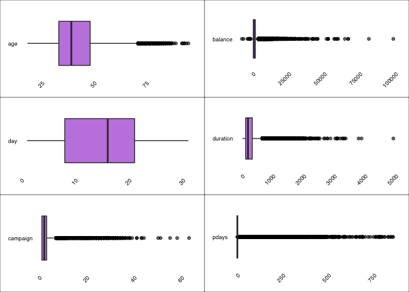
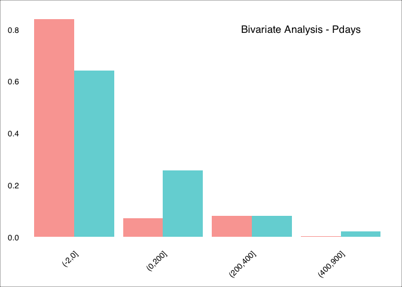

Predicting Term Deposits
================
MBD | ADVANCED R | June 2019

 

-----

## Bank Marketing Dataset

The *Bank Marketing* dataset contains the **direct marketing campaigns
of a Portuguese banking institution**. The original dataset can be found
on [Kaggle](https://www.kaggle.com/henriqueyamahata/bank-marketing).

All the files of this project are saved in a [GitHub
repository](https://github.com/ashomah/Bank-Marketing).

The dataset consists in:

  - **Train Set** with 36,168 observations with 16 features and the
    target `y`.  
  - **Test Set** with 9,043 observations with 16 features. The `y`
    column will be added to the Test Set, with NAs, to ease the
    pre-processing stage.

This project aims to predict if a customer will subscribe to a bank term
deposit, based on its features and call history of previous marketing
campaigns.

 

-----

## Packages

This analysis requires these R packages:

  - Data Manipulation: `data.table`, `dplyr`, `tibble`, `tidyr`

  - Plotting: `corrplot`, `GGally`, `ggmap`, `ggplot2`, `grid`,
    `gridExtra`

  - Machine Learning: `caret`, `dbscan`, `glmnet`, `leaderCluster`,
    `MLmetrics`, `ranger`, `xgboost`

  - Multithreading: `doMC`, `doParallel`, `factoextra`, `foreach`,
    `parallel`

  - Reporting: `kableExtra`, `knitr`, `RColorBrewer`, `shiny`, and…
    `beepr`.

These packages are installed and loaded if necessary by the main script.

 

-----

## Data Loading

The data seems to be pretty clean, the variables being a combination of
integers and factors with no null values.

    ## [1] "0 columns of the Train Set have NAs."
    ## [1] "0 columns of the Test Set have NAs."

 

As this analysis is a classification, the target `y` has to be set as
factor. The structures of the datasets after initial preparation are:

    ## Structure of the Train Set:
    ## 'data.frame':    36168 obs. of  17 variables:
    ##  $ age      : int  50 47 56 36 41 32 26 60 39 55 ...
    ##  $ job      : Factor w/ 12 levels "admin.","blue-collar",..: 3 10 4 2 5 9 9 2 8 1 ...
    ##  $ marital  : Factor w/ 3 levels "divorced","married",..: 2 2 2 2 2 3 3 2 1 1 ...
    ##  $ education: Factor w/ 4 levels "primary","secondary",..: 1 2 1 1 1 3 2 1 2 2 ...
    ##  $ default  : num  1 0 0 0 0 0 0 0 0 0 ...
    ##  $ balance  : int  537 -938 605 4608 362 0 782 193 2140 873 ...
    ##  $ housing  : num  1 1 0 1 1 0 0 1 1 1 ...
    ##  $ loan     : num  0 0 0 0 0 0 0 0 0 1 ...
    ##  $ contact  : Factor w/ 3 levels "cellular","telephone",..: 3 3 1 1 1 1 1 2 1 3 ...
    ##  $ day      : int  20 28 19 14 12 4 29 12 16 3 ...
    ##  $ month    : Factor w/ 12 levels "apr","aug","dec",..: 7 9 2 9 9 4 5 9 1 7 ...
    ##  $ duration : int  11 176 207 284 217 233 297 89 539 131 ...
    ##  $ campaign : int  15 2 6 7 3 3 1 2 1 1 ...
    ##  $ pdays    : int  -1 -1 -1 -1 -1 276 -1 -1 -1 -1 ...
    ##  $ previous : int  0 0 0 0 0 2 0 0 0 0 ...
    ##  $ poutcome : Factor w/ 4 levels "failure","other",..: 4 4 4 4 4 1 4 4 4 4 ...
    ##  $ y        : Factor w/ 2 levels "No","Yes": 1 1 1 1 1 2 1 1 1 1 ...

    ## Structure of the Test Set:
    ## 'data.frame':    9043 obs. of  17 variables:
    ##  $ age      : int  58 43 51 56 32 54 58 54 32 38 ...
    ##  $ job      : Factor w/ 12 levels "admin.","blue-collar",..: 5 10 6 5 2 6 7 2 5 5 ...
    ##  $ marital  : Factor w/ 3 levels "divorced","married",..: 2 3 2 2 3 2 2 2 2 3 ...
    ##  $ education: Factor w/ 4 levels "primary","secondary",..: 3 2 1 3 1 2 3 2 3 3 ...
    ##  $ default  : num  0 0 0 0 0 0 0 0 0 0 ...
    ##  $ balance  : int  2143 593 229 779 23 529 -364 1291 0 424 ...
    ##  $ housing  : num  1 1 1 1 1 1 1 1 1 1 ...
    ##  $ loan     : num  0 0 0 0 1 0 0 0 0 0 ...
    ##  $ contact  : Factor w/ 3 levels "cellular","telephone",..: 3 3 3 3 3 3 3 3 3 3 ...
    ##  $ day      : int  5 5 5 5 5 5 5 5 5 5 ...
    ##  $ month    : Factor w/ 12 levels "apr","aug","dec",..: 9 9 9 9 9 9 9 9 9 9 ...
    ##  $ duration : int  261 55 353 164 160 1492 355 266 179 104 ...
    ##  $ campaign : int  1 1 1 1 1 1 1 1 1 1 ...
    ##  $ pdays    : int  -1 -1 -1 -1 -1 -1 -1 -1 -1 -1 ...
    ##  $ previous : int  0 0 0 0 0 0 0 0 0 0 ...
    ##  $ poutcome : Factor w/ 4 levels "failure","other",..: 4 4 4 4 4 4 4 4 4 4 ...
    ##  $ y        : Factor w/ 2 levels "No","Yes": NA NA NA NA NA NA NA NA NA NA ...

 

-----

## Exploratory Data Analysis

The target of this analysis is the variable `y`. This boolean indicates
whether the customer has acquiered a bank term deposit account. With
88.4% of the customers having subscribed to this product, we can say
that our Train set is slightly unbalanced. We might want to try
rebalancing our dataset later in this analysis, to ensure our model is
performing properly for unknown data.

The features of the dataset provide different type of information about
the customers.

 

  - Variables giving **personal information** of the customers:
    
      - **`age`** of the customer  
        Customers are between 18 and 95 years old, with a mean of
        40.9579739 and a median of 39. The inter-quartile range is
        between 33 and 48. We can also notice the presence of some
        outliers.
    
      - **`job`** category of the customer  
        There are 12 categories of jobs with more than half belonging to
        `blue-collar`, `management` and `technicians`, followed by admin
        and services. Retired candidates form 5% of the dataset,
        self-emplyed and entrepreneur around 6% and unemployed,
        housemaid and students each around 2%. The candidate with unknow
        jobs form less than 1%.
    
      - **`marital`** status of the customer  
        60% are married, 28% are single, the others are divorced.
    
      - **`education`** level of the customer  
        51% of the customers went to secondary school, 29% to tertiary
        school, 15% to primary school. The education of the other
        customers remains unknown.

 

  - Variables related to **financial status** of the customers:
    
      - **`default`** history  
        This boolean indicates if the customer has already defaulted.
        Only 1.8% of the customers have defaulted.
    
      - **`balance`** of customer’s account  
        The average yearly balance of the customer in euros. The
        variable is ranged from -8,019 to 98,417 with a mean of 1,360
        and a median of 448. The data is highly right-skewed.
    
      - **`housing` ** loan  
        This boolean indicates if the customer has a house loan. 56% of
        the customers have one.
    
      - **`loan`**  
        This boolean indicates if the customer has a personal loan. 16%
        of the customers have one.

 

  - Variables related to **campaign interactions** with the customer:
    
      - **`contact`** mode  
        How the customer was contacted, with 65% on their mobile phone,
        and 6% ona landline.
    
      - **`day`**  
        This indicates on which day of the month the customer was
        contacted.
    
      - **`month`**  
        This indicates on which month the customer was contacted. May
        seems to be the peak month with 31% of the calls followed by
        June, July, and August.
    
      - **`duration`** of the call  
        Last phone call duration in seconds. The average call lasts
        around 4 minutes. However, the longest call lasts 1.4 hours.
    
      - **`campaign`**  
        Number of times the customer was contacted *during* this
        campaign. Customers can have been contacted up to 63 times.
        Around 66% were contacted twice or less.
    
      - **`pdays`**  
        Number of days that passed after the customer was last contacted
        from a previous campaign. `-1` means that the client was not
        previously contacted and this is his first campaign. Around 82%
        of the candidates are newly campaign clients. The average time
        elapsed is 40 days.
    
      - **`previous`** contacts  
        Number of contacts performed *before* this campaign. Majority of
        the customers were never contacted. Other customers have been
        contacted 1 times on average, with a maximum of 58 times.
    
      - **`poutcome`** This categorical variable indicates the outcome
        from a previous campaign, whether it was a success or a failure.
        About 3% of the customers answered positively to previous
        campaigns.

 

<iframe src ="http://ashomah.shinyapps.io/plot_eda" height=900px width=100% position="center" frameborder="0" />

\#\#\#Test set

Looking at the raw test set in which we will have to consider as our
unseen data and predict the outcomer we can see that it is
representitive of the train set in which the variables follow almost
similar summary
parameters.

### Univariate Analysis: Categorical Variables

### Univariate Analysis: Numerical Variables

<!-- -->

### Bivariate Analysis: Each Variable against Target (Y)

Let’start from the *Categorical Variables*
:

#### Job

<!-- -->

#### Marital status

<!-- -->

Single people are more likely to open a deposit. Married people are less
likely. Divorced
50%-50%

#### Education

<!-- -->

Higher education, higher chance to open a
deposit.

#### Contact

<!-- -->

People contacted via cellular are more likely to open a
deposit.

#### Month

<!-- -->

#### Default

<!-- -->

#### Housing

<!-- -->

#### Loan

<!-- -->

Let’s continue with the *numerical* variables. In order to be able to
display the relationship between the variable Target(Y) and the
numerical variables, the latter have been binned, in order to make the
graph easier to
read.

#### Age

<!-- -->

#### Balance

<!-- -->

#### Day

<!-- -->

#### Duration

<!-- -->

#### Campaign

<!-- -->

#### Pdays

<!-- -->

#### Previous

<!-- -->

 

-----

## Data Preparation

 

-----

## Cross-Validation Strategy

To validate the stability of our models, we will apply a 10-fold
cross-validation, repeated 3
times.

 

-----

## Baseline

<table class="table table-hover table-condensed" style="margin-left: auto; margin-right: auto;">

<thead>

<tr>

<th style="text-align:right;">

Model

</th>

<th style="text-align:right;">

Accuracy

</th>

<th style="text-align:right;">

Sensitivity

</th>

<th style="text-align:right;">

Precision

</th>

<th style="text-align:right;">

Recall

</th>

<th style="text-align:right;">

F1 Score

</th>

<th style="text-align:right;">

AUC

</th>

<th style="text-align:right;">

Coefficients

</th>

<th style="text-align:right;">

Train Time (min)

</th>

</tr>

</thead>

<tbody>

<tr>

<td style="text-align:right;">

Logistic Reg.
baseline

</td>

<td style="text-align:right;">

0.9039126

</td>

<td style="text-align:right;">

0.9774789

</td>

<td style="text-align:right;">

0.9189825

</td>

<td style="text-align:right;">

0.9774789

</td>

<td style="text-align:right;">

0.9473285

</td>

<td style="text-align:right;">

0.7928246

</td>

<td style="text-align:right;">

49

</td>

<td style="text-align:right;">

0.5

</td>

</tr>

<tr>

<td style="text-align:right;">

XGBoost
baseline

</td>

<td style="text-align:right;">

0.9144200

</td>

<td style="text-align:right;">

0.9684079

</td>

<td style="text-align:right;">

0.9369042

</td>

<td style="text-align:right;">

0.9684079

</td>

<td style="text-align:right;">

0.9523956

</td>

<td style="text-align:right;">

0.8065931

</td>

<td style="text-align:right;">

48

</td>

<td style="text-align:right;">

25.3

</td>

</tr>

<tr>

<td style="text-align:right;">

Ranger
baseline

</td>

<td style="text-align:right;">

0.9112401

</td>

<td style="text-align:right;">

0.9632468

</td>

<td style="text-align:right;">

0.9380140

</td>

<td style="text-align:right;">

0.9632468

</td>

<td style="text-align:right;">

0.9504630

</td>

<td style="text-align:right;">

0.7928451

</td>

<td style="text-align:right;">

48

</td>

<td style="text-align:right;">

75.3

</td>

</tr>

</tbody>

</table>

 

-----

## Feature Engineering

 

-----

## Feature Selection with Lasso and RFE

 

-----

## Tuning

 

-----

## Final Model

The best model
for…

<iframe src ="http://ashomah.shinyapps.io/model_dash" height=900px width=100% position="center" frameborder="0" />

  

-----

###### *Nayla Fakhoury | Martin Hofbauer | Andres Llerena | Francesca Manoni | Paul Jacques-Mignault | Ashley O’Mahony | Stavros Tsentemeidis*

###### *O17 (Group G) | Master in Big Data and Business Analytics | Oct 2018 Intake | IE School of Human Sciences and Technology*

-----
