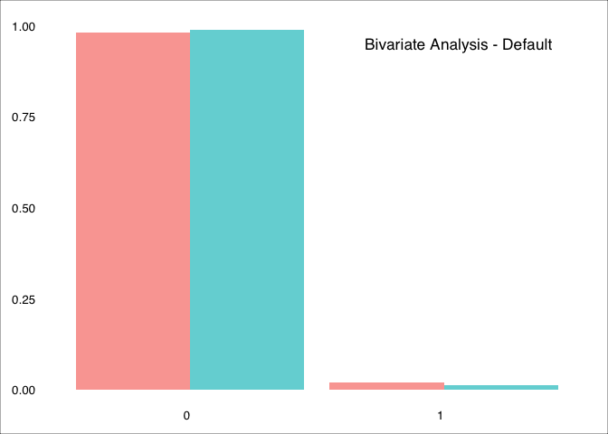
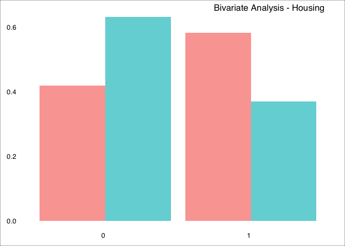
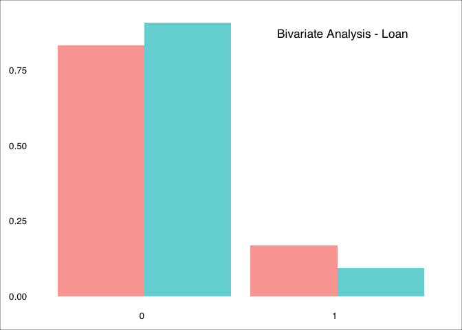

Predicting Term Deposits
================
MBD | ADVANCED R | June 2019

 

-----

## Bank Marketing Dataset

BLABLABLAThe *Bank Marketing* dataset contains the **direct marketing
campaigns of a Portuguese banking institution**. The original dataset
can be found on
[Kaggle](https://www.kaggle.com/henriqueyamahata/bank-marketing).

All the files of this project are saved in a [GitHub
repository](https://github.com/ashomah/Bank-Marketing).

The dataset consists in:

  - **Train Set** with 36168 observations with 16 features and the
    target `y`.  
  - **Test Set** with 9043 observations with 16 features. The `y` column
    will be added to the Test Set, with NAs, to ease the pre-processing
    stage.

This project aims to predict if a customer will subscribe to a bank term
deposit, based on its features and call history.

 

-----

## Packages

This analysis requires these R packages:

  - Data Manipulation: `data.table`, `dplyr`, `tibble`, `tidyr`

  - Plotting: `corrplot`, `GGally`, `ggmap`, `ggplot2`, `grid`,
    `gridExtra`

  - Machine Learning: `caret`, `dbscan`, `glmnet`, `leaderCluster`,
    `MLmetrics`, `ranger`, `xgboost`

  - Multithreading: `doMC`, `doParallel`, `factoextra`, `foreach`,
    `parallel`

  - Reporting: `kableExtra`, `knitr`, `RColorBrewer`, `shiny`, and…
    `beepr`.

These packages are installed and loaded if necessary by the main script.

 

-----

## Data Preparation

The dataset is pretty clean…

 

-----

## Exploratory Data Analysis

The target of this analysis is…

### Bivariate Analysis: Each Variable against Target (Y)

Let’start from the *Categorical Variables*
:

#### Job

<!-- -->

#### Marital status

<!-- -->

Single people are more likely to open a deposit. Married people are less
likely. Divorced
50%-50%

#### Education

<!-- -->

Higher education, higher chance to open a
deposit.

#### Contact

<!-- -->

People contacted via cellular are more likely to open a
deposit.

#### Month

<!-- -->

#### Default

<!-- -->

#### Housing

<!-- -->

#### Loan

<!-- -->

Let’s continue with the *numerical* variables. In order to be able to
display the relationship between the variable Target(Y) and the
numerical variables, the latter have been binned, in order to make the
graph easier to
read.

#### Age

<!-- -->

#### Balance

<!-- -->

#### Day

<!-- -->

#### Duration

<!-- -->

#### Campaign

<!-- -->

#### Pdays

<!-- -->

#### Previous

<!-- -->

 

-----

## Data Preparation

 

-----

## Cross-Validation Strategy

To validate the stability of our models, we will apply a 10-fold
cross-validation, repeated 3
times.

 

-----

## Baseline

<table class="table table-hover table-condensed" style="margin-left: auto; margin-right: auto;">

<thead>

<tr>

<th style="text-align:right;">

Model

</th>

<th style="text-align:right;">

Accuracy

</th>

<th style="text-align:right;">

Sensitivity

</th>

<th style="text-align:right;">

Precision

</th>

<th style="text-align:right;">

Recall

</th>

<th style="text-align:right;">

F1 Score

</th>

<th style="text-align:right;">

Coefficients

</th>

<th style="text-align:right;">

Train Time (min)

</th>

</tr>

</thead>

<tbody>

<tr>

<td style="text-align:right;">

Logistic Reg.
baseline

</td>

<td style="text-align:right;">

0.9032213

</td>

<td style="text-align:right;">

0.9768533

</td>

<td style="text-align:right;">

0.9187996

</td>

<td style="text-align:right;">

0.9768533

</td>

<td style="text-align:right;">

0.9469375

</td>

<td style="text-align:right;">

49

</td>

<td style="text-align:right;">

0.4

</td>

</tr>

<tr>

<td style="text-align:right;">

XGBoost
baseline

</td>

<td style="text-align:right;">

0.9091663

</td>

<td style="text-align:right;">

0.9685643

</td>

<td style="text-align:right;">

0.9314183

</td>

<td style="text-align:right;">

0.9685643

</td>

<td style="text-align:right;">

0.9496282

</td>

<td style="text-align:right;">

48

</td>

<td style="text-align:right;">

26.2

</td>

</tr>

<tr>

<td style="text-align:right;">

Ranger
baseline

</td>

<td style="text-align:right;">

0.9057099

</td>

<td style="text-align:right;">

0.9641852

</td>

<td style="text-align:right;">

0.9315503

</td>

<td style="text-align:right;">

0.9641852

</td>

<td style="text-align:right;">

0.9475868

</td>

<td style="text-align:right;">

48

</td>

<td style="text-align:right;">

83.3

</td>

</tr>

</tbody>

</table>

 

-----

## Feature Engineering

 

-----

## Feature Selection with Lasso and RFE

 

-----

## Tuning

 

-----

## Final Model

The best model
for…

  

-----

###### *Nayla Fakhoury | Martin Hofbauer | Andres Llerena | Francesca Manoni | Paul Jacques-Mignault | Ashley O’Mahony | Stavros Tsentemeidis*

###### *O17 (Group G) | Master in Big Data and Business Analytics | Oct 2018 Intake | IE School of Human Sciences and Technology*

-----
